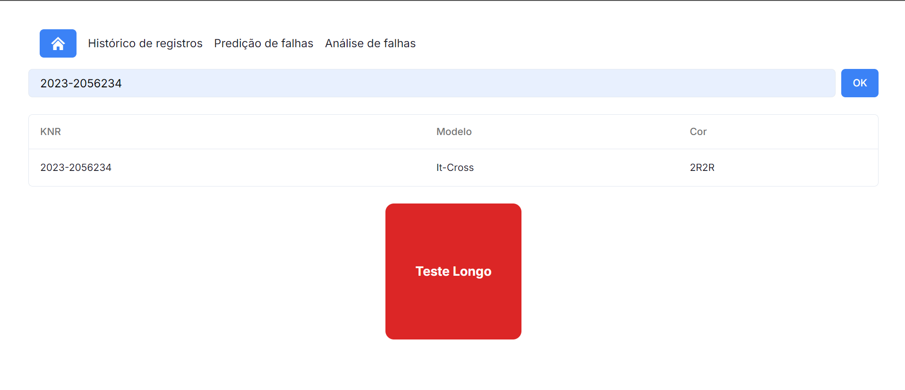
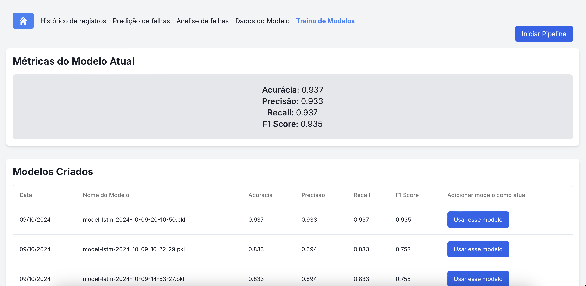
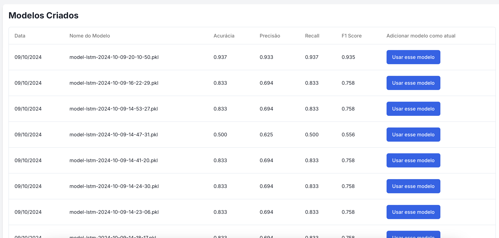
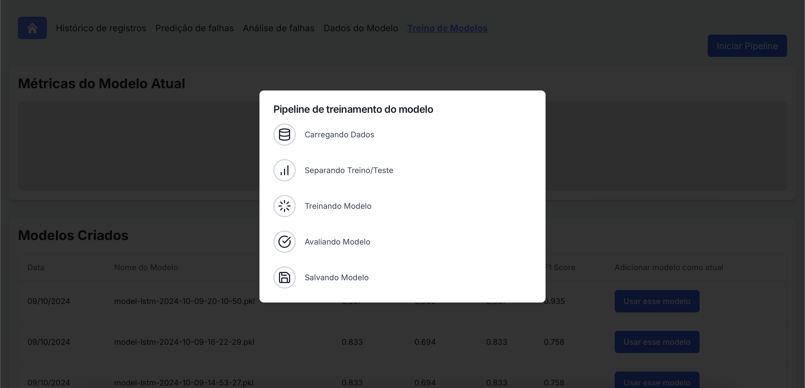
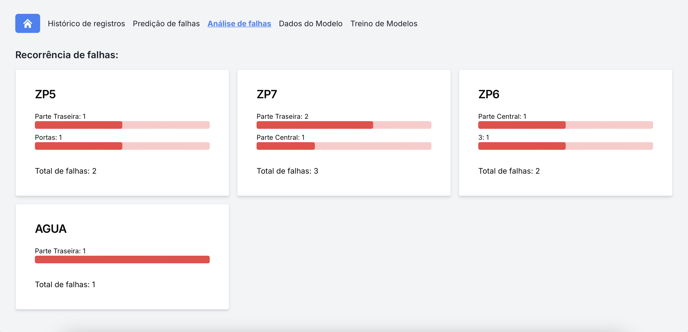

Documentação oficial do sistema de manutenção preditiva desenvolvido pelo grupo IT CROSS para a Volkswagen Brasil.

## Escopo
Diariamente milhares de carros são montados nas fábricas da Volkswagen, onde cada um desses carros passa por um processo de "rodagem", na qual passa por diversas estações até o processo final de montagem. No processo de rodagem, os mais diversos tipos de erro podem aparecer, e é importantíssimo mitigar qualquer erro possível a fim de maximizar o uso do tempo na montadora.
## Problema
Observando os dados relativos às falhas em diversos veículos diferentes, foi notada uma necessidade de maior assertividade no tipo de inspeção que deve ser realizado em determinados veículos na rodagem.
## Solução
Com este problema em mente, foi desenvolvido um sistema de manutenção preditiva, que têm como objetivo identificar veículos que potencialmente apresentarão falhas durante o processo de rodagem, assim podendo aplicar uma manutenção antes da falha em si.

# Implementação
## Requisitos do projeto

Logo no início do projeto foi necessário definir os requisitos dele em duas categorias: funcionais e não funcionais. Os **requisitos funcionais** descrevem o comportamento esperado do sistema, especificando as funcionalidades que ele deve oferecer para atender às expectativas dos usuários e solucionar o problema proposto. Por outro lado, os **requisitos não funcionais** se concentram em critérios de qualidade, restrições e aspectos como desempenho, segurança e usabilidade, que garantem que o sistema opere de maneira eficiente e confiável.

### Requisitos Funcionais (RF)

RF01: **Classificação de Veículos**  
O sistema deve classificar se o veículo necessita de alguma inspeção ou se apresenta algum problema. Partindo disso, o modelo deve predizer se deverá ser feita uma inspeção ou identificar algum problema.

RF02: **Segurança e Privacidade**  
O sistema deve garantir a proteção dos dados sensíveis e prevenir acessos não autorizados, assegurando a integridade dos dados durante o processamento e transmissão.

RF03: **Integração com AWS**  
O sistema deve ser projetado para integração com alguma provedora de cloud. A infraestrutura deve ser capaz de escalar automaticamente conforme a demanda e assegurar alta disponibilidade.

RF04: **Interface Visual e Monitoramento dos Dados**  
O resultado do algoritmo deve ser apresentado de forma visual e compreensível em um dashboard para melhor tomada de decisão, indicando o tipo de inspeção necessária para cada veículo.

RF05: **API do Modelo**  
O sistema deve disponibilizar uma API para que a Volkswagen possa integrar o modelo de classificação em seus sistemas internos, permitindo a automação do processo de inspeção. A API deve também possibilitar o retreino dos modelos com novos dados.

RF06: **Adicionar novos dados**  
O sistema deve permitir a adição de novos dados para treinamento do modelo, garantindo a atualização contínua do algoritmo e a melhoria da precisão das predições.

### Requisitos Não Funcionais (RNF)

RNF01: **Precisão e Confiabilidade**  
O modelo de classificação deve alcançar uma taxa de acurácia mínima de 95% na classificação de veículos com problemas.

RNF02: **Escalabilidade e Alta Disponibilidade**  
A infraestrutura deve garantir um SLA acima de 97,0% de disponibilidade e ser capaz de escalar para atender a um aumento de até 300% na carga de trabalho em momentos de pico, com um tempo de inatividade máximo de 0,01% por mês.

RNF03: **Tempo de Resposta e Usabilidade**  
A interface visual deve apresentar os resultados de classificação em até 3 segundos após a solicitação do usuário. O dashboard deve ser desenvolvido para atender as heurísticas de Nielsen.

RNF04: **Conformidade com Normas de Proteção de Dados**  
O sistema deve estar em conformidade com regulamentos de proteção de dados, como LGPD e GDPR, incluindo a implementação de controles de acesso rigorosos e anonimização de dados pessoais quando necessário.

RNF05: **Compatibilidade e Portabilidade**  
O sistema deve ser compatível com diferentes versões de navegadores (Chrome, Firefox, Safari) e sistemas operacionais (Windows, Linux, macOS). Deve também ser portável para execução em ambientes locais e na nuvem, sem a necessidade de reconfigurações extensivas. (Implementável no GitHub Actions)

## Dados Utilizados

Para o treinamento do modelo, a Volkswagen forneceu um vasto conjunto de dados relacionados ao processo de rodagem dos veículos e às possíveis falhas identificadas durante este processo. Esses dados incluíam informações detalhadas sobre o tempo que cada carro passou em cada estação da linha de rodagem, permitindo um mapeamento preciso das etapas de produção. Além disso, foram fornecidos dados sobre os diferentes tipos de falhas que ocorreram em cada estação, como problemas mecânicos, elétricos ou de componentes específicos. Essas informações foram cruciais para identificar padrões e treinar o modelo preditivo, ajudando a antecipar falhas e otimizar o processo produtivo.

## Tecnologias Usadas / Desenvolvimento do Projeto

### Sprint 1: Análise do Modelo de Negócios e Exploração dos Dados
Na primeira fase do desenvolvimento, foi realizada uma análise detalhada do modelo de negócios, com o objetivo de entender as necessidades e requisitos do projeto, especialmente no que diz respeito à classificação de veículos e inspeções automatizadas. Paralelamente, foi conduzida uma análise exploratória dos dados (EDA), focada em identificar padrões e comportamentos relevantes que poderiam ser utilizados para treinar o modelo de predição. Durante esta fase, tecnologias como **Python**, **Pandas** e **Matplotlib** foram usadas para manipulação e visualização dos dados.

### Sprint 2: Análise dos Dados e Construção do Primeiro Modelo
Com uma visão mais clara do conjunto de dados, o foco desta sprint foi na análise mais aprofundada dos dados e na construção do primeiro modelo de classificação. Técnicas de pré-processamento de dados foram aplicadas para lidar com dados ausentes, normalização e categorização das variáveis. A partir disso, um modelo inicial foi treinado utilizando algoritmos de redes neurais recorrentes, tais como **GRU** e **LSTM**. Os resultados obtidos neste estágio forneceram uma linha de base para otimizar a solução nas fases seguintes.

### Sprint 3: Retratamento dos Dados, Feature Engineering, Validação Cruzada e Dockerização
Nesta fase, o foco foi no retratamento dos dados e na execução de **feature engineering** para otimizar as variáveis utilizadas pelo modelo. Foram aplicadas técnicas como a criação de novas variáveis e a remoção de outliers para melhorar a qualidade dos dados. Além disso, foi realizado um processo de **validação cruzada** para garantir que o modelo não sofresse de overfitting, ajudando a melhorar a generalização das predições. 

Simultaneamente, a aplicação foi **dockerizada**, o que facilitou sua escalabilidade e implantação em diferentes ambientes, garantindo maior consistência no comportamento do sistema independentemente da plataforma em que estivesse rodando.

### Sprint 4: Processo ETL e Funcionalidades de Retreinamento
Nesta sprint, foi implementado um processo de **ETL (Extract, Transform, Load)** para automatizar a ingestão e o tratamento de dados, assegurando que o modelo fosse continuamente atualizado com novos dados. Além disso, foi criado um mecanismo para permitir o **retreinamento automático** do modelo quando novos dados fossem inseridos no sistema, garantindo a longevidade e a precisão contínua das predições.

### Sprint 5: Toques Finais e Deploy na AWS
Na fase final do projeto, o foco foi dado aos últimos ajustes necessários para garantir que o sistema estivesse pronto para produção. Foram feitas otimizações no código, melhorias na interface visual do dashboard, e os toques finais para garantir a usabilidade da solução. A aplicação foi, então, implantada na **AWS** utilizando **Instâncias EC2**, assegurando alta disponibilidade, escalabilidade e conformidade com os requisitos de desempenho e segurança estabelecidos.

## Funcionalidades
### Funcionalidades Principais

- **Previsão de Falhas em ROD com base no KNR do Carro**  
      
    A plataforma possui uma funcionalidade que permite prever falhas antes do processo de rodagem (ROD) com base no KNR. Ao inserir o KNR, o sistema busca todas as informações relevantes do veículo, como histórico de inspeções, dados de produção e falhas anteriores. Essas informações são então processadas pelo modelo preditivo, que analisa os dados e retorna um resultado indicando teste longo ou curto. Essa funcionalidade é crucial para antecipar problemas e realizar manutenções preventivas, garantindo maior eficiência e segurança no processo produtivo da Volkswagen.

- **Monitoramento constante dos diversos modelos**  
      
    O sistema oferece uma funcionalidade de monitoramento contínuo para acompanhar o desempenho dos diferentes modelos de machine learning em tempo real. Isso garante que eventuais mudanças na qualidade das predições sejam rapidamente identificadas, permitindo ajustes ou retrainings rápidos, sempre visando manter a precisão e eficiência do modelo em produção.

- **Consulta e seleção de modelos desenvolvidos**  
    
    Os usuários têm a capacidade de acessar e consultar qualquer um dos modelos desenvolvidos ao longo do processo. O sistema permite uma seleção flexível, onde é possível escolher o modelo que melhor se adapta ao cenário atual, de acordo com os critérios específicos de desempenho ou a necessidade de ajustes para determinados casos de uso.

- **Processo automatizado de retreinamento com novos dados**  
    
    O sistema implementa um pipeline automatizado de retreinamento, que se ativa sempre que novos dados são adicionados. Essa funcionalidade garante que o modelo esteja constantemente atualizado, refinando as predições com as últimas informações disponíveis, o que aumenta a precisão e a relevância do modelo para o contexto atual.

- **Insights sobre o processo produtivo com dashboards**  
     
    A solução oferece dashboards interativos e visuais que fornecem insights detalhados sobre o processo produtivo. Esses dashboards permitem que os usuários tomem decisões mais informadas, visualizando dados críticos de forma clara, como o tipo de inspeção necessária para cada veículo, a performance dos modelos e as métricas de qualidade do processo de manutenção.

## Fase de Testes

No dia 8 de outubro de 2024, a equipe conduziu uma série de testes da plataforma, tanto em nuvem quanto localmente, com três participantes de idades entre 19 e 25 anos. Durante os testes, foram feitas diversas perguntas para avaliar diferentes aspectos da plataforma, incluindo a funcionalidade do site, o processo de treinamento do modelo e a usabilidade das páginas de predição, análise de falhas, dados do modelo e histórico de registros.
Um dos participantes apontou que o site ainda não está funcional, mencionando a falta de acabamentos visuais e dificuldades de navegação, sugerindo a inclusão de uma indicação da página atual na barra de navegação para melhorar a experiência do usuário. Outro participante sugeriu melhorias, como a adição de um botão de voltar e hover na navbar, além de observar que o processo de criação de modelos não estava funcionando corretamente. Ele também propôs mudar a cor da precisão de acordo com os percentuais para melhor visualização. O terceiro participante relatou dificuldades em entender o propósito da criação de um novo modelo e sugeriu que o quadrado vermelho fosse mais claro em sua funcionalidade.
Em relação à página de predição, um participante elogiou o design visual, enquanto outro sugeriu a utilização de uma tabela horizontal para organizar melhor as informações. As páginas de análise de falhas e de dados do modelo foram bem avaliadas por todos, sendo descritas como intuitivas e com transições adequadas. Por fim, a página de histórico de registros também recebeu elogios pela sua estética e clareza na disposição das informações.

## Próximos Passos

### Acompanhamento 

Para garantir o sucesso da implementação da solução de manutenção preditiva, o próximo passo envolve a realização de testes na linha de produção da Volkswagen. O sistema deve ser validado em ambiente real para assegurar que os modelos de predição mantêm um desempenho consistente, identificando falhas de forma antecipada e precisa. Durante o acompanhamento, métricas como o tempo de resposta, a acurácia das predições e a eficácia das inspeções recomendadas serão monitoradas. Esse processo é essencial para ajustar o modelo conforme as condições reais de operação, permitindo um ciclo contínuo de melhoria com base nos dados de produção. A equipe técnica estará em constante contato com os operadores da fábrica para identificar possíveis ajustes e novas demandas que possam surgir.

### Novas Funcionalidades

Com base nas necessidades que podem emergir ao longo do uso, diversas funcionalidades adicionais poderão ser incorporadas à plataforma. Uma das principais possibilidades envolve a integração com sistemas de IoT, permitindo que sensores conectados diretamente nos veículos transmitam dados em tempo real para o sistema de manutenção preditiva, melhorando a precisão das predições. Além disso, uma funcionalidade de **análise preditiva avançada** pode ser adicionada para sugerir ações corretivas automáticas, dependendo do tipo de falha identificada.

Essas melhorias visam não apenas otimizar a usabilidade da plataforma, mas também elevar o nível de automação e predição, proporcionando ainda mais valor para o processo produtivo da Volkswagen.

## Conclusão

A solução de manutenção preditiva proposta pela nossa equipe para a Volkswagen Brasil se mostrou eficaz na identificação antecipada de falhas no processo de rodagem dos veículos, contribuindo para otimizar o tempo e os recursos na fábrica. Durante o desenvolvimento, nossa equipe priorizou a integração com a infraestrutura em nuvem, a segurança de dados e a escalabilidade, garantindo um sistema eficiente e de alta disponibilidade. Os testes realizados forneceram insights valiosos para melhorias na interface e na usabilidade, e com os ajustes propostos, o software construído estará preparado para aumentar a assertividade das inspeções e impulsionar a eficiência operacional da Volkswagen.
