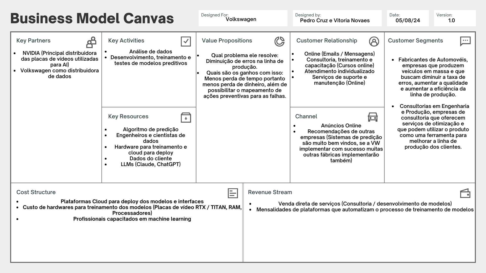
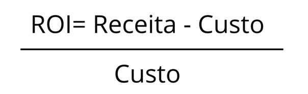
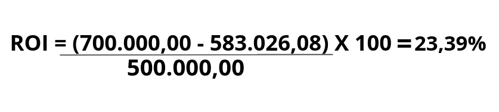

# Análise Financeira: Viabilidade Econômica do Projeto IT-CROSS

## Introdução

&emsp;Nesta seção, abordaremos a análise financeira da Poc e do projeto em sua versão final implementado pelo o grupo IT-CROSS. Vamos descrever e detalhar os custos associados à produção, desde os custos com desenvolvedores até os impostos sobre o projeto. O objetivo é fornecer uma visão clara dos investimentos necessários para validar a viabilidade do projeto antes de avançar para a implementação em larga escala.

## Business Model Canvas: Como iremos gerar Valor para o projeto?

&emsp;A proposta de valor do projeto é fundamental para definir como o projeto IT-CROSS vai gerar valor significativo para a Volkswagen. A seguir, exploramos os principais aspectos ao observar o Business Model Canvas:

<b> Figura 1 - Figura Business Model Canvas</b>

  
  
<b>Fonte:</b> Elaborado por IT-CROSS

>Nota: Não avaliamos e nem consideramos todo o BMC, apenas dois fatores que estão descritos abaixo que consideramos crucial serem explorados.

### Redução de Erros na Linha de Produção

&emsp;Um dos maiores desafios na produção em massa de veículos é a ocorrência de erros na linha de produção, que podem resultar em produtos defeituosos, recall de veículos, e perda financeira significativa. Com a implementação do projeto pela equipe IT-CROSS, a Volkswagen terá acesso a um sistema de predição que identifica potenciais falhas antes que elas aconteçam. Isso permitirá à empresa:

- **Diminuir a taxa de defeitos:** Garantindo que os veículos saiam da linha de produção com alta qualidade.
- **Evitar retrabalho:** Economizando tempo e recursos ao eliminar a necessidade de corrigir defeitos após a produção.
- **Melhorar a eficiência operacional:** Permitindo uma produção mais fluida e sem interrupções.

### Expansão e Adaptação

&emsp;O sistema IT-CROSS é escalável e pode ser adaptado para outras fábricas da Volkswagen ao redor do mundo, assim como para outros setores de produção. Isso proporciona:

- **Flexibilidade:** Capacidade de adaptação do sistema a diferentes linhas de produção e tipos de veículos.
- **Crescimento global:** Potencial de expansão do sistema para outras unidades de produção da Volkswagen, ampliando os benefícios em escala global.
- **Personalização:** Possibilidade de ajustar o sistema para atender a necessidades específicas de diferentes mercados ou segmentos.

&emsp;Ao reduzir erros na linha de produção, economizar tempo e recursos, e permitir ações preventivas eficazes, o projeto se alinha perfeitamente com os objetivos estratégicos da Volkswagen de manter-se na vanguarda da inovação tecnológica e da excelência operacional. 

&emsp;Em suma, a proposta de valor feita sobre os ganhos do projeto, destaca como a combinação de tecnologia avançada e uma abordagem estratégica robusta pode não apenas resolver problemas imediatos, mas também criar uma base sólida para o futuro da Volkswagen no mercado automotivo global. Com a implementação bem-sucedida deste projeto, a Volkswagen não só reforçará sua reputação como líder em inovação, mas também garantirá a satisfação e a lealdade dos seus clientes, posicionando-se de forma ainda mais competitiva no mercado.

## Levantamento de Custos 

&emsp;Para auxiliar na identificação e estimativa dos custos envolvidos no projeto, dividimos a análise em duas seções distintas: Protótipo e Projeto Implementado. Cada seção aborda os custos específicos relacionados às diferentes fases do projeto, garantindo uma compreensão clara e detalhada dos investimentos necessários.

## Protótipo (Poc)

&emsp;Iremos considerar um período de 2 meses para realizar o protótipo, dividindo os custos entre os **desenvolvedores** e o custo da **infraestrutura** para manter a solução na nuvem (cloud). Portanto, as pesquisas e o cálculo relacionados aos investimentos será levando em consideração esse tempo.

### Desenvolvimento de Software: Custo médio da mão de obra

| Função                 | Quantidade | Meses | Salário Mensal | Valor Final    | Fonte                |
| ---------------------  | ---------- | ----- | -------------- | -------------- | -------------------- |
| Engenheiro de Software | 2          | 2     | R$ 6.303,00    | R$ 25.212,00   | [VAGAS](https://www.vagas.com.br/cargo/engenheiro-de-software#:~:text=No%20cargo%20de%20Engenheiro%20de,de%20R%24%206.303%2C00.) |
| Cientista de Dados     | 2          | 2     | R$ 10.053,00      | R$ 40.212,00   | [GLASSDOR](https://www.glassdoor.com.br/Sal%C3%A1rios/cientista-de-dados-sal%C3%A1rio-SRCH_KO0,18.htm) |
| Engenheiro de DevOps   | 1          | 2     | R$ 9.000,00       | R$ 18.000,00      | [GLASSDOR](https://www.glassdoor.com.br/Sal%C3%A1rios/devops-engineer-sal%C3%A1rio-SRCH_KO0,15.htm) |
| Gestor de Projetos     | 1          | 2     | R$ 4.742,00    | R$ 9.484,00   | [VAGAS](https://www.vagas.com.br/cargo/gestao-de-projetos) |
| **Total**              |            |       |                | **R$ 92.908,00** |                    |

>Nota: Ao clicar no nome dos sites na coluna "**Fontes**", onde pesquisamos, você será redirecionado diretamente para visualizar os dados da média salarial de cada profissão em questão.
>Data da pesquisa: 10/08/2024

### Custos da infraestrutura na nuvem (Cloud)

&emsp;Para estimar os custos da infraestrutura em nuvem para o protótipo inicial, pesquisamos e consideramos os seguintes aspectos pensando em um escopo de 2 meses:

| Serviço                | Quantidade | Valor/Mês   | Valor Final | 
| ---------------------  | ---------- | ----- | -------------- | 
| Computação             | 2 instâncias de máquinas virtuais com 4 vCPUs e 16 GB de RAM | R$ 0,50 por hora x 2 instâncias x 160 horas = R$ 1.600,00 | R$ 3.200,00 | 
| Armazenamento          | 500 GB de armazenamento em SSD | R$ 0,25 por GB x 500 GB = R$ 125,00 | R$ 250,00 | 
| Rede                   | 1 TB de transferência de dados | R$ 0,10 por GB x 1.024 GB = R$ 102,40 |  R$ 204,80 |
| Monitoramento e Logs   | Cloud Watch | R$ 200,00 | R$ 400,00    | 
| Banco de Dados         | 200 GB de banco de dados relacional | R$ 500,00 | R$ 1.000,00 | 
| **Total**              |            |       | **R$ 5.054,80**  |  

>Nota I: As fontes da pesquisa feita para o custo de infraestrutura foram feitas a partir da calculadora de preços de três empresas que oferecem o melhor preço no mercado: [Google Cloud](https://cloud.google.com/products/calculator/?utm_source=google&utm_medium=cpc&utm_campaign=latam-BR-all-pt-dr-BKWS-all-all-trial-p-dr-1707800-LUAC0014411&utm_content=text-ad-none-any-DEV_c-CRE_534950712418-ADGP_Hybrid+%7C+BKWS+-+PHR+%7C+Txt_GCP-Price+Calculator-KWID_43700071226328618-kwd-527030757336&utm_term=KW_google%20cloud%20platform%20pricing%20calculator-ST_google+cloud+platform+pricing+calculator&gad_source=1&gclid=Cj0KCQjwn9y1BhC2ARIsAG5IY-6JiY0ScOr-yHDcpRZh_r15BxP9dBPXCe7JVaEZTPqJbRbdtnIEzc8aAtZLEALw_wcB&gclsrc=aw.ds), [Azure](https://azure.microsoft.com/en-us/pricing/calculator/) e [AWS](https://calculator.aws/#/). 
>Nota II: Os impostos sobre esses serviços já são inclusos na cobrança pela plataforma utilizada.

### Custo total do protótipo

&emsp;Para melhorar a visualização, iremos somar o custo da mão de obra com o custo de infraestrutura em uma única tabela:

| Descrição                            | Valor            |
| ------------------------------------ | ---------------- |
| Custos relacionados a mão de obra    | **R$ 92.908,00** |
| Custos relacionados a infraestrutura | **R$ 5.054,80**  |
| Custo total para implementação       | **R$ 97.962,80** |

### Valor final: Margem de Lucro + Imposto da Nota Fiscal

&emsp;Ao calcular a margem de lucro, consideramos que ela pode variar um pouco, geralmente ficando entre 10% e 20%. Dado que o aporte para um protótipo de um sistema de manutenção preditiva com IA com arquitetura em nuvem tende a ser caro, é prudente evitar a cobrança de um valor muito elevado. Portanto, calculamos a margem de lucro considerando uma taxa mínima de 10%.

&emsp;Além disso, é importante considerar os impostos de emissão da nota fiscal, que no Brasil representam cerca de 18% do valor total do serviço ou produto. Esse imposto é obrigatório e deve ser incluído no cálculo do valor final para garantir a conformidade fiscal e evitar problemas legais futuros.

&emsp; Para calcular o imposto, utilizamos o método de cálculo "Por dentro". Esse método considera o imposto como parte integrante do valor do produto ou serviço. O resultado é um aumento na alíquota real e no preço final do produto. Por exemplo, se uma camisa custa R$ 100,00, o cálculo do imposto "Por dentro" seria feito da seguinte forma: 100,00 / (1-0,18) = R$ 121,95. Esse cálculo foi aplicado na adição do imposto em nosso projeto. Para mais informações, você pode conferir o artigo sobre [Cálculo "por dentro" X "por fora"](https://www.portaldaindustria.com.br/cni/canais/reforma-tributaria/infograficos/calculo-por-dentro-x-por-fora/).

| Descrição | + Lucro (10%) | Custos + Lucro | Impostos de emissão da NF (18%) | Valor final |
| --------- | ------------- | -------------- | ------------------------------- | ----------- |
| Custos para a implementação do protótipo | R$ 9.796,28 | R$ 107.759,08 | R$ 23.654,43 | R$ 131.413,51 | 

## Projeto Implementado

&emsp;Para realizar os cálculos e estimativa do projeto implementado após a validação do protótipo iremos seguir na mesma linha de raciocínio, considerando os mesmo serviços e valores, algumas coisas irão mudar, como por exemplo o tempo de desenvolvimento e implementação do produto. 

&emsp;Iremos considerar um período de 6 meses para realizar a implementação do projeto final, dividindo os custos entre os **desenvolvedores**, o custo da **infraestrutura** para manter a solução na nuvem (cloud) e **custos adicionais** para essa segunda fase do projeto, portanto, as pesquisas e o cálculo relacionados aos investimentos será levando em consideração esse tempo.

>Nota: A implementação final do projeto acrescenta 4 meses de trabalho aos 2 meses já dedicados ao desenvolvimento do protótipo. Portanto, o projeto completo, desde a fase inicial (protótipo) até a implementação final, será concluído em **6 meses no total**. Os primeiros **2 meses são destinados à criação e avaliação do protótipo**, seguidos por **4 meses para a implementação completa do sistema.**

### Desenvolvimento de Software: Custo médio da mão de obra

| Função                 | Quantidade | Meses | Salário Mensal | Valor Final    | Fonte                |
| ---------------------  | ---------- | ----- | -------------- | -------------- | -------------------- |
| Engenheiro de Software | 2          | 4     | R$ 6.303,00    | R$ 50.424,00   | [VAGAS](https://www.vagas.com.br/cargo/engenheiro-de-software#:~:text=No%20cargo%20de%20Engenheiro%20de,de%20R%24%206.303%2C00.) |
| Cientista de Dados     | 2          | 4     | R$ 10.053,00      | R$ 80.424,00   | [GLASSDOR](https://www.glassdoor.com.br/Sal%C3%A1rios/cientista-de-dados-sal%C3%A1rio-SRCH_KO0,18.htm) |
| Engenheiro de DevOps   | 1          | 4     | R$ 9.000,00       | R$ 36.000,00      | [GLASSDOR](https://www.glassdoor.com.br/Sal%C3%A1rios/devops-engineer-sal%C3%A1rio-SRCH_KO0,15.htm) |
| Gestor de Projetos     | 1          | 4     | R$ 4.742,00    | R$ 18.968,00  | [VAGAS](https://www.vagas.com.br/cargo/gestao-de-projetos) |
| **Total**              |            |       |                | **R$ 185.816,00** |                    |

>Nota: Ao clicar no nome dos sites na coluna "**Fontes**", onde pesquisamos, você será redirecionado diretamente para visualizar os dados da média salarial de cada profissão em questão.
>Data da pesquisa: 10/08/2024

### Custos da infraestrutura na nuvem (Cloud)

&emsp;Para estimar os custos da infraestrutura em nuvem para o restante da implementação do projeto, pesquisamos e consideramos os seguintes aspectos pensando em um escopo de **+ 4 meses**:

| Serviço                | Quantidade | Valor/Mês   | Valor Final | 
| ---------------------  | ---------- | ----- | -------------- | 
| Computação             | 2 instâncias de máquinas virtuais com 4 vCPUs e 16 GB de RAM | R$ 0,50 por hora x 2 instâncias x 160 horas = R$ 1.600,00 | R$ 6.400,00 | 
| Armazenamento          | 500 GB de armazenamento em SSD | R$ 0,25 por GB x 500 GB = R$ 125,00 | R$ 500,00 | 
| Rede                   | 1 TB de transferência de dados | R$ 0,10 por GB x 1.024 GB = R$ 102,40 |  R$ 409,60 |
| Monitoramento e Logs   | Cloud Watch | R$ 200,00 | R$ 800,00    | 
| Banco de Dados         | 200 GB de banco de dados relacional | R$ 500,00 | R$ 2.000,00 | 
| **Total**              |            |       | **R$ 10.109,60**  |  

>Nota I: As fontes da pesquisa feita para o custo de infraestrutura foram feitas a partir da calculadora de preços de três empresas que oferecem o melhor preço no mercado: [Googl Cloud](https://cloud.google.com/products/calculator/?utm_source=google&utm_medium=cpc&utm_campaign=latam-BR-all-pt-dr-BKWS-all-all-trial-p-dr-1707800-LUAC0014411&utm_content=text-ad-none-any-DEV_c-CRE_534950712418-ADGP_Hybrid+%7C+BKWS+-+PHR+%7C+Txt_GCP-Price+Calculator-KWID_43700071226328618-kwd-527030757336&utm_term=KW_google%20cloud%20platform%20pricing%20calculator-ST_google+cloud+platform+pricing+calculator&gad_source=1&gclid=Cj0KCQjwn9y1BhC2ARIsAG5IY-6JiY0ScOr-yHDcpRZh_r15BxP9dBPXCe7JVaEZTPqJbRbdtnIEzc8aAtZLEALw_wcB&gclsrc=aw.ds), [Azuere](https://azure.microsoft.com/en-us/pricing/calculator/) e [AWS](https://calculator.aws/#/). 
>Nota II: Os custos adicionais são importantes para a finalização do projeto, mas podem ser reduzidos e até mesmo cortados em partes pontuais (como suporte e treinamento) para assim garantir a viabilidade econômica. 

### Custos adicionais

&emsp;Após a fase inicial de implementação do protótipo, a finalização do projeto certamente trará custos adicionais. Abaixo, estimamos alguns desses custos, com base na experiência e nas expectativas para a fase II de implementação. No entanto, é importante notar que essa lista não é exaustiva; podem surgir outros custos, assim como alguns dos listados podem não se concretizar.

| Descrição | Estimativa de Custo | Comentários | 
| --------- | ------------------- | ----------- |
| Testes em larga escala | ~ R$ 37.500,00 | Inclui ferramentas de teste e pen testing |  
| Manutenção Contínua | ~ R$ 15.000,00 | Atualizações, correções, otimizações |
| Suporte Pós-Implementação | ~ R$ 75.000,00 | Suporte técnico para treinamento de colaboradores |
| Total de custos adicionais | ~ R$ 127.500,00 |

>Nota I: Os custos adicionais apresentados são estimados e, por isso, indicados com o símbolo de aproximadamente (~). Para os custos de testes, utilizamos as ferramentas da [AWS](https://calculator.aws/#/) como referência. O custo de manutenção foi estimado em ~10% do valor total do projeto. Já para suporte e treinamento, os valores foram baseados em preços de mercado praticados por empresas como Red Hat, Microsoft e consultorias como a ThoughtWorks.

>Nota II: Os custos adicionais são importantes para a finalização do projeto, mas podem ser enxugados e até mesmo considerar o corte de alguns, como suporte e treinamento, para assim garantir a viabilidade econômica. 

:::warning

Atenção!! O valor de manutenção e suporte após a implementação não inclui a implementação de novas features no projeto ou no modelo, apenas recalibragem e ajustes em geral.

:::

### Custo total do restante da implementação do projeto (+4 meses de desenvolvimento)

&emsp;Para melhorar a visualização, iremos somar o custo da mão de obra + infraestrutura + custos adicionais em uma única tabela:

| Descrição                                        | Valor               |
| ------------------------------------------------ | ------------------- |
| Custos relacionados a mão de obra                | **R$ 185.816,00**   |
| Custos relacionados a infraestrutura             | **R$ 10.109,60**    |
| Custos adcionais                                 | **~ R$ 127.500,00** |
| Custo total para finalizar a implementação       | **R$ 323.425,60**   |

### Valor final: Margem de Lucro + Imposto da Nota Fiscal

&emsp;Para calcular o valor final do projeto implementado iremos considerar três vertentes diferentes: I - Primeiro vamos realizar o cálculo do lucro + imposto sobre a implementação dos 2 meses apenas (fase do protótipo). II - Segunda vertente, iremos realizar o cálculo do lucro + imposto sobre a implementação dos 4 meses apenas (que seria a segunda fase do projeto). III - Terceira e última vertente que seria a fase de protótipo + fase final da implementação. Dessa maneira, conseguimos visualizar e comparar as fases da implementação e os custos que o cliete irá ter para realizar o investimento.

:::info

Esse trecho explicando sobre como consideramos e calculamos o lucro + impostos sobre os custos do projeto está bem parecido ao que escrevemos na seção do protótipo, entretanto, alteramos o lucro sobre a implementação final do projeto.

:::

&emsp;Ao calcular a margem de lucro, consideramos uma variação entre 10% e 20%. Para a implementação final do projeto, decidimos utilizar uma margem de 15%, já que a fase de "testes" (protótipo) foi concluída e o cliente optou por seguir com o restante do projeto. Dessa forma, aumentamos a porcentagem de lucro para garantir um bom retorno. No entanto, ao fazer os cálculos finais, a margem de lucro foi ajustada para 14,5%.

&emsp;Além disso, é importante considerar os impostos de emissão da nota fiscal, que no Brasil representam cerca de 18% do valor total do serviço ou produto. Esse imposto é obrigatório e deve ser incluído no cálculo do valor final para garantir a conformidade fiscal e evitar problemas legais futuros.

&emsp; Para calcular o imposto, utilizamos o método de cálculo "Por dentro". Esse método considera o imposto como parte integrante do valor do produto ou serviço. O resultado é um aumento na alíquota real e no preço final do produto. Por exemplo, se uma camisa custa R$ 100,00, o cálculo do imposto "Por dentro" seria feito da seguinte forma: 100,00 / (1-0,18) = R$ 121,95. Esse cálculo foi aplicado na adição do imposto em nosso projeto. Para mais informações, você pode conferir o artigo sobre [Cálculo "por dentro" X "por fora"](https://www.portaldaindustria.com.br/cni/canais/reforma-tributaria/infograficos/calculo-por-dentro-x-por-fora/).

| Descrição | + Lucro | Custos + Lucro | Impostos de emissão da NF (18%) | Valor final |
| --------- | ------------- | -------------- | ------------------------------- | ----------- |
| Custos para a implementação do protótipo | (Lucro de 10%) R$ 9.796,28 | R$ 107.759,08 | R$ 23.654,43 | R$ 131.413,51 | 
| Custos para a implementação da segunda II do projeto | (Lucro de 14,5%) R$ 46.896,71  | R$ 370.322,31 | R$ 81.290,26 | R$ 451.612,57 | 
| Custos para a implementação total do projeto | (Lucro de 10% fase I + 14,5% na fase II) R$ 56.692,99  | R$ 478.081,39 | R$ 104.944,69| R$ 583.026,08 | 

## Fontes de Receita

&emsp;Neste tópico, abordaremos as principais fontes de receita do projeto IT-CROSS. Identificar e compreender essas fontes é essencial para garantir a sustentabilidade financeira e o sucesso do projeto a longo prazo. As fontes de receita podem incluir, mas não se limitam as seguintes estratégias que mapeamos:

### Suporte e Manutenção

- **Planos de Suporte:** Receita gerada por contratos de suporte contínuo, oferecendo assistência técnica, manutenção e atualizações regulares. 

- **Manutenção Programada:** Receita proveniente de serviços de manutenção periódica e atualizações de sistema para garantir a continuidade e a eficiência operacional do software.

### ROI (Retorno Sobre o Investimento)

&emsp;Para realizar o cálculo do retorno sobre o investimento podemos analisar a seguinte fórmula:

<b> Figura 2 - Retorno Sobre o Investimento</b>

  
  
<b>Fonte:</b> Elaborado por IT-CROSS

- Receita: É a soma de todas as fontes de receita.
- Custo: É a soma de todos os custos necessários para desenvolver, implementar, e manter o projeto.

### Interpretação do ROI:

- ROI Positivo (Maior que zero): Indica que o projeto está gerando mais receita do que o custo, o que sugere **viabilidade** e potencial de lucro.

- ROI Negativo (Menor que zero): Indica que o custo está superando a receita, o que pode sugerir necessidade de **reavaliação** ou ajuste do projeto para melhorar a rentabilidade.

### Exemplo de cáclulo

&emsp;Se, por exemplo, o Custo Total Estimado para desenvolver e implementar o IT-CROSS for R$ 583.026,08 e a Receita Total Estimada for R$ 700.000,00 com a venda de contratos de suporte e expansão para outras plantas, o ROI seria calculado da seguinte forma:

<b> Figura 3 - Retorno Sobre o Investimento cálculo</b>

  
  
<b>Fonte:</b> Elaborado por IT-CROSS

>Nota: O valor da receita foi estimado a partir da tabela `Custos adicionais` presente nesse documento. Diante disso, consideramos uma parceria com o cliente por cerca de 6 meses utilizando os nossos serviços de manutenção e suporte. 

&emsp;Neste exemplo, um ROI de 23,39% indica que o projeto é financeiramente viável e que a Volkswagen pode esperar um retorno de 23,39% sobre o investimento inicial.

## Análise de Viabilidade Financeira 

&emsp;Para determinar a viabilidade financeira do projeto IT-CROSS, é essencial avaliar se os benefícios e retornos esperados justificam o investimento necessário. A análise será conduzida com base nos seguintes aspectos:

### Análise de Custo-Benefício

&emsp;No caso da Volkswagen, a análise de custo-benefício apresenta um caráter um tanto subjetivo, dado que o projeto não visa escalar o produto para o mercado, mas sim utilizá-lo internamente para aprimorar a qualidade da produção. O principal objetivo é evitar perdas significativas nos ativos da empresa, que são os veículos, ao final da montagem. Diante desse cenário, o produto pode ajudar a Volkswagen a mitigar:

- **Redução de Custos com Defeitos:** Implementar um sistema de manutenção preditiva pode diminuir os custos associados a defeitos e retrabalho, que são comuns em processos de montagem de veículos. A identificação antecipada de falhas pode evitar reparos caros e garantir a entrega de produtos com qualidade superior.

- **Impacto Financeiro a Longo Prazo:** Embora o investimento inicial possa parecer elevado, os benefícios financeiros a longo prazo, como a redução de custos com manutenção e a proteção de ativos, podem superar os custos iniciais e trazer um retorno significativo sobre o investimento.

### Impacto no Valor da Empresa

&emsp;O impacto do projeto de manutenção preditiva no valor da empresa Volkswagen pode ser avaliado sob várias perspectivas. Embora o projeto esteja inicialmente destinado a uso interno, os benefícios resultantes têm o potencial de influenciar positivamente a valorização da empresa de várias maneiras:

- **Melhoria da Rentabilidade:** A redução de custos operacionais e de manutenção através de um sistema de manutenção preditiva pode aumentar a margem de lucro da Volkswagen. Menos gastos com reparos e menos perdas na produção significam um aumento direto na rentabilidade, o que pode refletir positivamente no valor da empresa.

- **Imagem e Reputação da Marca:** A implementação bem-sucedida de tecnologias avançadas para melhorar a qualidade e a eficiência pode reforçar a imagem da Volkswagen como uma líder em inovação e excelência operacional. Uma reputação positiva e a percepção de alta qualidade podem aumentar a confiança dos investidores e melhorar o valor de mercado da empresa.

### Ganhos Tangíveis e Intangíveis

&emsp;A análise de ganhos tangíveis e intangíveis é crucial para compreender o impacto total do projeto de manutenção preditiva na Volkswagen. Esses ganhos não só ajudam a justificar o investimento, mas também fornecem uma visão mais completa dos benefícios que o projeto pode oferecer.

- **Diminuição de Paradas Não Planejadas:** Com a implementação do sistema de manutenção preditiva, a Volkswagen pode reduzir o tempo de inatividade não planejado das linhas de produção. Isso resulta em uma produção mais contínua e eficiente, aumentando a capacidade de produção e, consequentemente, a receita.

- **Redução de Desperdícios:** Ao evitar falhas e problemas durante a produção, a Volkswagen pode reduzir o desperdício de materiais e produtos defeituosos. Isso não só economiza recursos, mas também melhora a eficiência operacional.

## Conclusão 

&emsp;A análise financeira do projeto IT-CROSS revela que, para a fase de protótipo, o custo total é de aproximadamente R$ 97.962,80, incluindo tanto a mão de obra quanto a infraestrutura na nuvem. Com a adição de uma margem de lucro de 10% e impostos sobre a nota fiscal, o valor final estimado é de R$ 131.413,51. Para a implementação completa do projeto, com um desenvolvimento adicional de 4 meses, os custos totais somam cerca de R$ 323.425,60, considerando a mão de obra, infraestrutura e custos adicionais. Incluindo a margem de lucro ajustada e impostos, o valor final é de R$ 583.026,08.

&emsp;Esses valores indicam um investimento significativo, porém necessário para garantir a viabilidade e a excelência do sistema de manutenção preditiva. A análise de custo-benefício sugere que, apesar dos altos custos iniciais, o retorno esperado com a melhoria da qualidade e a redução de perdas pode justificar o investimento. A continuidade do projeto deve considerar esses custos e os benefícios a longo prazo, alinhando-os com os objetivos estratégicos da Volkswagen e o valor agregado pela solução proposta.