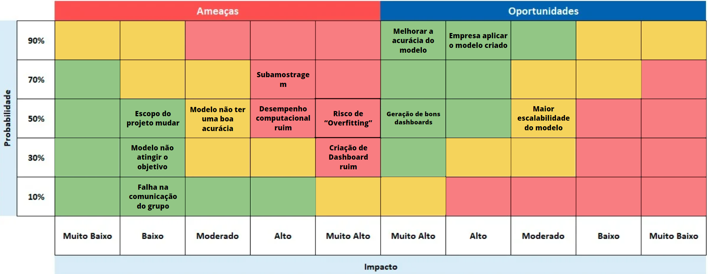

# Matriz de Riscos
&emsp; A matriz de riscos é uma ferramenta fundamental na gestão de projetos, projetada para identificar, categorizar e gerenciar riscos potenciais ao longo de todo o projeto. Com a flexibilidade para se ajustar conforme novos eventos surgem, ela ajuda a visualizar a probabilidade e o impacto de cada risco, facilitando a priorização de ações de mitigação. Além de abordar os riscos, a matriz também considera oportunidades que podem aumentar o valor do projeto, permitindo uma abordagem mais estratégica.

**OBS: Todos os itens dispostos na matriz de risco vão estar descritos logo abaixo para melhor compreensão de onde pode-se encontrar os verdadeiros riscos/oportunidades e como mitigalos/potencializa-los**

<h2 align="center"> Figura 1 - Matriz de Riscos </h2>

<h6 align="center"> Fonte: Elaboração Grupo IT-Cross </h6>

# Planos de Prevenção e Ataque
&emsp; Além da criação da Matriz de Risco, também é desenvolvido um plano de prevenção para evitar que os riscos se concretizem, bem como um plano de ação para lidar com os riscos caso eles se tornem realidade.

### 1. Escopo do projeto mudar
- **Prevenção**: Alinhar com a Volkswagen as expectativas e limitações do projeto, destacando que o foco será no desenvolvimento de um MVP com a maior taxa de acerto possível, sem garantir um valor mínimo. Esclarecer que não serão realizados processos extensivos de limpeza de dados ou inclusão de big data.
- **Ataque**: Se o escopo mudar e forem solicitados requisitos adicionais, renegociar prazos e recursos, replanejando o projeto conforme necessário.

### 2. Modelo não atingir o objetivo
- **Prevenção**: Nas primeiras sprints, garantir que os dados recebidos da Volkswagen sejam suficientemente representativos e balanceados para treinar o modelo preditivo de forma eficaz, visando atingir a assertividade acima de 95%. **OBS: Vale ressaltar que na TAPI fala "...a assertividade do modelo será a maior possível que os estudantes conseguirem desenvolver durante a produção do MVP, mas não será garantido um valor de assertividade mínimo..."**
- **Ataque**: Se o modelo não tiver uma boa taxa de acerto que se aproxime de 95%, realizar ajustes nos parâmetros, otimizar o treinamento, e testar diferentes algoritmos de machine learning para melhorar a performance.

### 3. Falha na comunicação do grupo
- **Prevenção**: Estabelecer uma rotina de comunicação clara e frequente entre a equipe (professor orientador podendo fazer a ponte de comunicação com a empresa) e a Volkswagen, definindo pontos de contato, métodos de comunicação, e momentos de alinhamento durante as sprints.
- **Ataque**:  Implementar checkpoints regulares e sessões de alinhamento para garantir que todos estejam cientes das mudanças e objetivos do projeto, minimizando a possibilidade de falhas na comunicação.

### 4. Modelo não ter uma boa acurácia
- **Prevenção**: Nas primeiras sprints, trabalhar com a Volkswagen para garantir que os dados de treinamento sejam adequados e suficientemente representativos para treinar o modelo com alta precisão.
- **Ataque**: Se o modelo não atingir a acurácia desejada, revisar o conjunto de dados, ajustar hiperparâmetros e utilizar técnicas de otimização para melhorar a precisão.

### 5. Desempenho computacional ruim
- **Prevenção**: Planejar o desenvolvimento do modelo de forma que ele seja eficiente em termos de uso de recursos computacionais, utilizando Python ou JavaScript conforme necessário. Testar o modelo em diferentes ambientes para garantir que ele funcione bem em produção.
- **Ataque**: Se o desempenho computacional não for satisfatório, considerar o uso de otimizações adicionais, como paralelização, e alavancar a infraestrutura da AWS para melhorar a eficiência.

### 6. Subamostragem
- **Prevenção**: Nas duas primeiras Sprints (15/04/2024 - 10/05/2024) combinar com Atvos a hipótese de recebimento dos dados das condiçẽos que caracterizm se um tubo esta sujo ou não para o treinamento.
- **Ataque**: Na eventualidade de não ser possível utilizar os dados fornecidos pela Atvos, será necessário recorrer a dados sintéticos/mockados para o treinamento do modelo.

### 7. Criação de dashboard ruim
- **Prevenção**: Envolver o analista de sistemas da fábrica desde o início do projeto para definir claramente os requisitos da interface visual, garantindo que o dashboard seja intuitivo e útil para os motoristas inspetores.
- **Ataque**: Se o dashboard não atender às expectativas, realizar iterações rápidas com base no feedback dos usuários finais para melhorar a interface e funcionalidade.

### 8. Risco de "Overfitting"
- **Prevenção**: Monitorar o treinamento do modelo para evitar overfitting, especialmente ao lidar com os dados fornecidos pela Volkswagen, que podem ser limitados ou específicos. Implementar validação cruzada e técnicas de regularização desde o início.
- **Ataque**: Se o overfitting for detectado, ajustar o modelo utilizando técnicas de regularização como validação cruzada, revisar os dados de treinamento, e melhorar a separação entre conjuntos de treino e teste para garantir a generalização do modelo.

# Referências 
[1] REDACAO PAPOCA. O que é matriz de risco? Aprenda como montar + exemplo. Esfera Energia. Disponível em: [https://blog.esferaenergia.com.br/gestao-empresarial/matriz-de-risco](https://blog.esferaenergia.com.br/gestao-empresarial/matriz-de-risco). Acesso em: 08 agosto. 2024.
