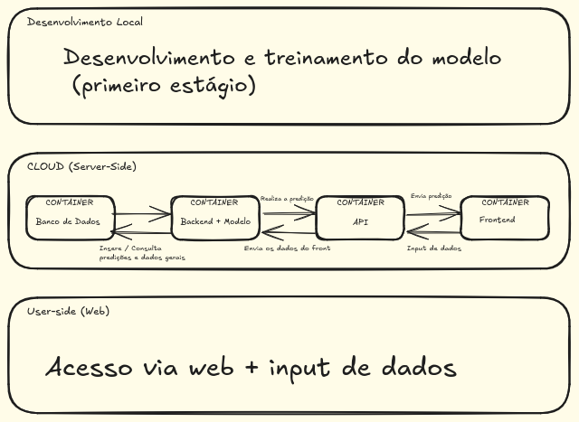

# Estudo de Viabilidade Técnica

## Introdução

&emsp;O presente estudo visa avaliar a viabilidade técnica de desenvolver uma solução com modelo preditivo para classificar veículos da Volkswagen do Brasil, com o objetivo de otimizar o processo de inspeção de rodagem. Para a realização deste estudo é necessário levar em conta diversos fatores, tais como os requisitos funcionais e não funcionais do projeto, disponibilidade financeira e quantidade / qualidade dos dados fornecidos pela Volkswagen.

## Análise Técnica

### Requisitos Funcionais do Sistema
- **RF01 - Classificação de Veículos:** O sistema deve ser capaz de classificar veículos em diferentes categorias com base em uma lista de parâmetros fornecidos.
- **RF02 - Segurança e Privacidade:** O sistema deve garantir a proteção dos dados sensíveis e prevenir acessos não autorizados, assegurando a integridade dos dados durante o processamento e transmissão.
- **RF03 - Integração com AWS:** O sistema deve ser projetado para integração com a AWS. A infraestrutura deve ser capaz de escalar automaticamente conforme a demanda e assegurar alta disponibilidade.
- **RF04 - Interface Visual:** O resultado do algoritmo deve ser apresentado de forma visual e compreensível, indicando o tipo de inspeção necessária para cada veículo.
- **RF05 - API do Modelo:** O sistema deve disponibilizar uma API para que a Volkswagen possa integrar o modelo de classificação em seus sistemas internos, permitindo a automação do processo de inspeção. Podendo também fazer o retreino dos modelos com novos dados.
- **RF06 - Adicionar novos dados:** O sistema deve permitir a adição de novos dados para treinamento do modelo, garantindo a atualização contínua do algoritmo e a melhoria da precisão das predições.

### Dados Disponíveis

&emsp;A Volkswagen forneceu um conjunto robusto de dados gerais sobre diversos tipos de veículos, incluindo informações como características técnicas, registros de manutenção, histórico de desempenho em testes de rodagem e dados de sensores durante o uso. Esses dados são essenciais para treinar e validar o modelo preditivo, garantindo que ele possa classificar corretamente os veículos em diferentes categorias com base nos parâmetros fornecidos.

&emsp;A quantidade e a qualidade dos dados fornecidos são satisfatórias para o desenvolvimento do modelo preditivo. Contudo, será necessário realizar uma limpeza e pré-processamento para garantir que os dados estejam em um formato adequado para treinamento do modelo, eliminando possíveis inconsistências e ruídos que possam prejudicar a assertividade.

### Tecnologias Propostas

- Linguagens de programação: Desenvolvimento do Modelo em Python, Desenvolvimento da interface em Javascript
- Ambiente de desenvolvimento dos modelos: Google Colab / Hardware do Inteli
- Ambiente de interface para interação com os modelos: Servidores Cloud (AWS, Azure, Oracle)

### Desafios Técnicos

- Atingir uma taxa de assertividade acima de 95%
- Implementação de um sistema de calibração mensal
- Criação de uma interface amigável para o usuário final

## Definição Clara do Objeto da Proposta Geral do Sistema

&emsp;O sistema proposto tem como objetivo principal otimizar o processo de inspeção de rodagem dos veículos fabricados pela Volkswagen do Brasil, por meio do desenvolvimento de um modelo preditivo. Esse modelo será capaz de classificar veículos em diferentes categorias, identificando previamente potenciais problemas ou necessidades de manutenção, com base em um conjunto de parâmetros técnicos e históricos de dados fornecidos pela Volkswagen.

&emsp;O sistema abrange desde a análise e pré-processamento dos dados até a implementação do modelo preditivo em um ambiente de produção, utilizando tecnologias robustas como Python para o desenvolvimento do modelo e AWS para garantir escalabilidade e alta disponibilidade. A solução proposta também inclui o desenvolvimento de uma interface intuitiva para visualização dos resultados, permitindo que os usuários finais tomem decisões informadas com base nas classificações realizadas pelo modelo.

&emsp;Uma feature importante do sistema é a capacidade de inserir novos dados ao longo do tempo, permitindo a recalibragem contínua do modelo. Essa funcionalidade assegura que o sistema possa evoluir e melhorar sua precisão à medida que novos padrões e tendências nos dados de veículos são identificados, garantindo uma maior assertividade nas classificações e mantendo o sistema alinhado com as necessidades dinâmicas da Volkswagen.

&emsp;A proposta geral do sistema visa, portanto, não apenas aumentar a precisão e a eficiência das inspeções, mas também reduzir custos operacionais, melhorar a qualidade dos veículos e fornecer uma base sólida para futuras inovações na cadeia produtiva da Volkswagen, com a flexibilidade necessária para se adaptar a novos desafios e dados.

## Conclusão da Viabilidade

&emsp;Após análise dos requisitos funcionais, dos desafios técnicos e da qualidade dos dados fornecidos pela Volkswagen, concluímos que é tecnicamente viável desenvolver a solução proposta. O volume e a qualidade dos dados disponíveis são adequados para treinar um modelo preditivo capaz de atingir uma taxa de assertividade acima de 95%, desde que seja implementado um processo rigoroso de calibração e monitoramento contínuo.

&emsp;Além disso, a escolha de tecnologias, como o uso de Python para o desenvolvimento do modelo e a integração com a AWS para a escalabilidade da solução, fortalece ainda mais a viabilidade técnica do projeto. O principal desafio será garantir a implementação de uma interface amigável e intuitiva que permita aos usuários finais compreenderem facilmente os resultados das classificações e agirem conforme necessário.

## Diagrama de Blocos

Figura 1 - Diagrama de blocos

Fonte: Elaborado pela equipe It-Cross

