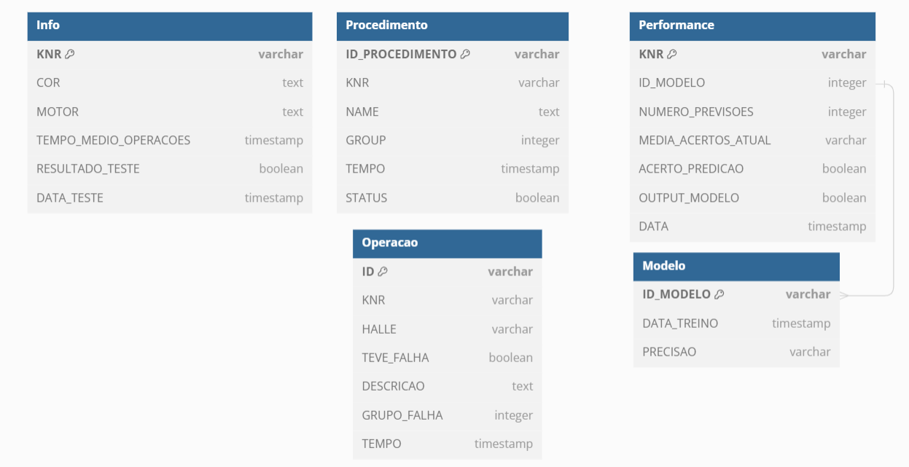

# Documentação do Banco de Dados

## Introdução

Nesta seção, detalharemos a estrutura e a configuração do banco de dados utilizado no projeto. Utilizamos o Supabase, uma plataforma de backend como serviço que utiliza PostgreSQL como nosso sistema de gerenciamento de banco de dados relacional, juntamente com o FastAPI para a construção da API. O Supabase facilita a criação de APIs, autenticação, e a gestão de dados, fornecendo uma solução completa para o desenvolvimento rápido e eficiente de aplicações.

## Tabelas Existentes

### Tabela Info

A tabela `Info` armazena informações gerais sobre cada veículo.

- **KNR**: Identificador único do veículo (chave primária).
- **COR**: Cor do veículo.
- **MOTOR**: Tipo de motor do veículo.
- **TEMPO_MEDIO_OPERACOES**: Tempo médio de operações.
- **RESULTADO_TESTE**: Resultado do teste (true/false).
- **DATA_TESTE**: Data do teste realizado.

```sql
CREATE TABLE Info (
  KNR varchar PRIMARY KEY,
  COR text,
  MOTOR text,
  TEMPO_MEDIO_OPERACOES timestamp,
  RESULTADO_TESTE boolean,
  DATA_TESTE timestamp
);
```

### Tabela Procedimento

A tabela `Procedimento` armazena os procedimentos realizados em cada veículo. Esta tabela foi criada com base no dataset de "Resultados" fornecido pelo parceiro. 

- **ID_PROCEDIMENTO**: Identificador único do procedimento (chave primária).
- **KNR**: Identificador do veículo (chave estrangeira referenciando Info.KNR).
- **NAME**: Nome do procedimento.
- **GROUP**: Grupo do procedimento.
- **TEMPO**: Tempo do procedimento.
- **STATUS**: Status do procedimento (true/false).

```sql
CREATE TABLE Procedimento (
  ID_PROCEDIMENTO varchar PRIMARY KEY,
  KNR varchar REFERENCES Info (KNR),
  NAME text,
  GROUP integer,
  TEMPO timestamp,
  STATUS boolean
);
```

### Tabela Operacao

A tabela `Operacao` armazena informações sobre operações específicas realizadas nos veículos. Esta tabela foi criada com base no dataset de "Falhas" fornecido pelo parceiro. Ela registra KNRs que tiveram falhas assim como os que não tiveram, para não enviesar o modelo.

- **ID**: Identificador único da operação (chave primária).
- **KNR**: Identificador do veículo (chave estrangeira referenciando Info.KNR).
- **HALLE**: Local onde a operação foi realizada.
- **TEVE_FALHA**: Indica se houve falha (true/false).
- **DESCRICAO**: Descrição da operação.
- **GRUPO_FALHA**: Grupo de falha associado.
- **TEMPO**: Tempo da operação.

```sql
CREATE TABLE Operacao (
  ID varchar PRIMARY KEY,
  KNR varchar REFERENCES Info (KNR),
  HALLE varchar,
  TEVE_FALHA boolean,
  DESCRICAO text,
  GRUPO_FALHA integer,
  TEMPO timestamp
);
```

### Tabela Performance

A tabela `Performance` armazena dados de performance e predições dos modelos aplicados aos veículos. Foi criada para controle nosso na aplicação que o parceiro irá utilizar. 

- **KNR**: Identificador do veículo (chave primária).
- **ID_MODELO**: Identificador do modelo (chave estrangeira referenciando Modelo.ID_MODELO).
- **NUMERO_PREVISOES**: Número de previsões realizadas.
- **MEDIA_ACERTOS_ATUAL**: Média de acertos atuais.
- **ACERTO_PREDICAO**: Indicador de acerto da predição (true/false).
- **OUTPUT_MODELO**: Saída do modelo (true/false).
- **DATA**: Data da avaliação.

```sql
CREATE TABLE Performance (
  KNR varchar PRIMARY KEY,
  ID_MODELO integer REFERENCES Modelo (ID_MODELO),
  NUMERO_PREVISOES integer,
  MEDIA_ACERTOS_ATUAL varchar,
  ACERTO_PREDICAO boolean,
  OUTPUT_MODELO boolean,
  DATA timestamp
);
```

### Tabela Modelo

A tabela `Modelo` armazena informações sobre os modelos de inteligência artificial utilizados para análise de performance.

- **ID_MODELO**: Identificador único do modelo (chave primária).
- **DATA_TREINO**: Data do treinamento do modelo.
- **PRECISAO**: Precisão do modelo.

```sql
CREATE TABLE Modelo (
  ID_MODELO varchar PRIMARY KEY,
  DATA_TREINO timestamp,
  PRECISAO varchar
);
```

## Representação Visual do Schema




## Explicação das Relações

- **INFO e PROCEDIMENTO**: Um veículo (INFO) pode ter múltiplos procedimentos associados (PROCEDIMENTO).
- **INFO e OPERACAO**: Um veículo (INFO) pode passar por várias operações (OPERACAO).
- **INFO e PERFORMANCE**: Um veículo (INFO) tem registros de performance que são avaliados (PERFORMANCE).
- **PERFORMANCE e MODELO**: Cada registro de performance utiliza um modelo específico (MODELO).

O diagrama acima mostra como as tabelas estão conectadas umas às outras através de chaves estrangeiras, fornecendo uma visão clara de como os dados fluem entre as tabelas.
