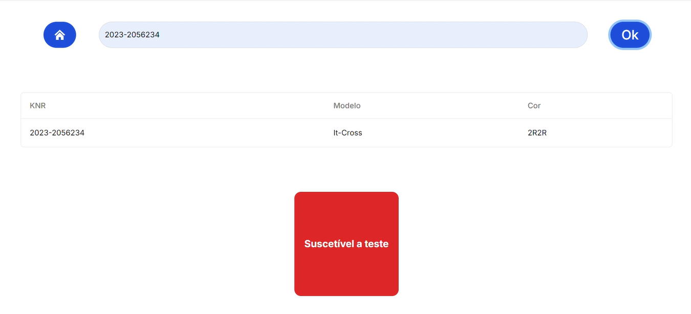
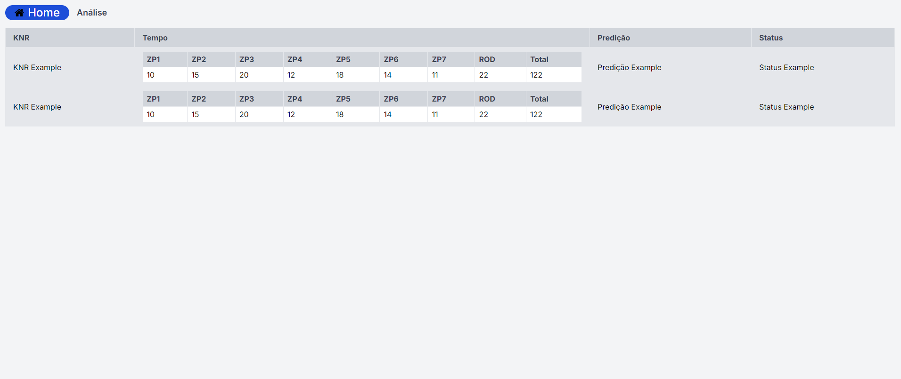
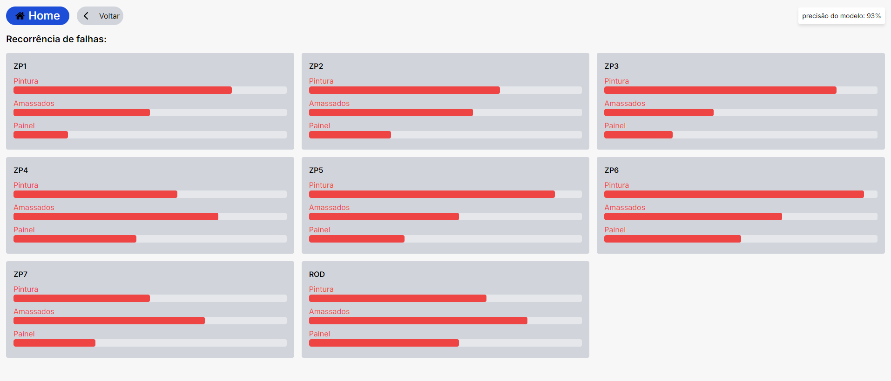

# Desenvolvimento das Telas

## Introdução

&emsp;Durante a segunda sprint do projeto, a equipe It-Cross desenvolveu uma interface gráfica para proporcionar ao parceiro uma melhor visualização dos dados do modelo preditivo. Seguindo o que foi confeccionado durante a etapa de wireframe, a interface do usuário (UI) foi desenvolvida utilizando o Next.js, que proporcionou uma experiência de desenvolvimento mais eficiente e flexível devido ao seu suporte a renderização híbrida e server-side rendering (SSR), permitindo otimização de performance e SEO. Na parte de estilização, a equipe optou por utilizar o framework de CSS chamado Tailwind, que proporcionou a personalização das páginas de maneira rápida e modular, facilitando a criação de designs responsivos e reutilizáveis, além de permitir a manutenção simplificada do código CSS.

## Tecnologias Utilizadas

### React

&emsp;React é uma biblioteca JavaScript que permite a construção de interfaces de usuário de maneira declarativa, simplificando a criação de componentes interativos e reutilizáveis, tornando o desenvolvimento de aplicações complexas mais eficiente. Ele também é muito utilizado para a criação de aplicações web e móveis. 

### Tailwind CSS

&emsp;Tailwind CSS é um framework que adota uma abordagem utilitária para a estilização, onde os desenvolvedores podem aplicar classes utilitárias diretamente aos elementos HTML, o que torna a manutenção de estilos mais consistente e acelera o desenvolvimento.

## Interface do Usuário

&emsp;Atualmente, foram desenvolvidas três páginas para mostrar de forma organizada e limpa os dados resultantes do modelo. Essas páginas são consecutivamente a de predição do modelo, histórico de carros na produção e uma página de análise derivada da página de histórico, a qual mostra detalhadamente cada tipo de falha ocorrida em cada checkpoint e durante a rodagem. A seguir, você poderá ver o desenvolvimento detalhado de cada página:

### Tela de predição do modelo

&emsp;Na tela de predição do modelo, você pode visualizar o modelo do carro e suas características inserindo o KNR do carro na caixa de texto onde está escrito "Insira o KNR". Após inserir o KNR, clique no botão "Ok". As informações do carro e suas características serão exibidas em uma tabela, com o resultado aparecendo logo abaixo dessa tabela.

<p style={{textAlign: 'center'}}>Figura 1 - Tela de predição </p>



<h6 align="center"> Fonte: Elaboração Grupo IT-Cross </h6>


### Implementação em React
```
responseJson['KNR'] = inputValue;
    responseJson['model'] = 'It-Cross';
    console.log("Resultado da predição: " + responseJson['prediction']);
    setData([responseJson]);
    setShowTable(true);
    // Atualiza o estado com base na predição
    if (responseJson['prediction'] == 1) {
      setPredictionTextOutput("Suscetível a teste");
      setCardColor('bg-red-600');  // Define a cor verde para resultado positivo
    } else {
      setPredictionTextOutput("NÃO suscetível a teste");
      setCardColor('bg-green-600');  // Define a cor vermelha para resultado negativo
    }
  };
  const handleInputChange = (event) => {
    setInputValue(event.target.value);
  };
  return (
    <main className="flex min-h-screen flex-col justify-between p-10">
      <div className="h-12 w-full flex justify-evenly mb-6">
        <BaseButton icon={IconHome} />
        <InputBar onChange={handleInputChange} />
        <BaseButton text='Ok' onClick={handleButtonClick} />
      </div>
      {showTable && data && <DataTable columns={columns} data={data} />}
      {showTable && data && (
        <div className="flex justify-center items-center mt-6">
          <BaseCard text={predictionTextOutput} color={cardColor} />  {/* Passa a cor como prop */}
        </div>
      )}
    </main>
  );
```

### Tela de Histórico

&emsp;A págine de histórico exibe todos os dados e resultados de predição relacionados aos KNRs analisados. Esses dados são apresentados em uma tabela para facilitar a visualização das informações. A linha dos títulos das colunas é fixa, enquanto as demais linhas são scrolláveis para acomodar a grande quantidade de dados. No topo da página, há dois botões: um que redireciona para a homepage e outro para a página de análise.

<p style={{textAlign: 'center'}}>Figura 2 - Tela de histórico </p>



<h6 align="center"> Fonte: Elaboração Grupo IT-Cross </h6>

### Implementação em React
```
function HistoryPage() {
  const renderTableRow = () => (
    <tr className="table-row">
      <td className="border px-4 py-2">KNR Example</td>
      <td className="border px-4 py-2">
        <table className="w-full bg-white">
          <thead>
            <tr className="table-header">
              <th className="border px-2 py-1 text-left">ZP1</th>
              <th className="border px-2 py-1 text-left">ZP2</th>
              <th className="border px-2 py-1 text-left">ZP3</th>
              <th className="border px-2 py-1 text-left">ZP4</th>
              <th className="border px-2 py-1 text-left">ZP5</th>
              <th className="border px-2 py-1 text-left">ZP6</th>
              <th className="border px-2 py-1 text-left">ZP7</th>
              <th className="border px-2 py-1 text-left">ROD</th>
              <th className="border px-2 py-1 text-left">Total</th>
            </tr>
          </thead>
          </tbody>
        </table>
  );

export default HistoryPage;
```
### Tela de Análise

&emsp;A página de análise serve como um dashboard da solução, exibindo cards para cada checkpoint da linha de produção de carros. Cada card contém um gráfico de barras horizontais que mostra a frequência de falhas por tipo em cada checkpoint. No canto superior direito, é exibida a precisão atual do modelo preditivo, auxiliando o gerente de qualidade na tomada de decisões, como focar em checkpoints com mais falhas, e na avaliação da confiabilidade das predições.

<p style={{textAlign: 'center'}}>Figura 3 - Tela de análise </p>



<h6 align="center"> Fonte: Elaboração Grupo IT-Cross </h6>

### Implementação em React
```
function AnalysisPage() {

  const zones = [
    { name: "ZP1", pintura: 80, amassados: 50, painel: 20 },
    { name: "ZP2", pintura: 70, amassados: 60, painel: 30 },
    { name: "ZP3", pintura: 85, amassados: 40, painel: 25 },
    { name: "ZP4", pintura: 60, amassados: 75, painel: 45 },
    { name: "ZP5", pintura: 90, amassados: 55, painel: 35 },
    { name: "ZP6", pintura: 95, amassados: 65, painel: 50 },
    { name: "ZP7", pintura: 50, amassados: 70, painel: 30 },
    { name: "ROD", pintura: 65, amassados: 80, painel: 55 },
  ];
}

export default AnalysisPage;
```


