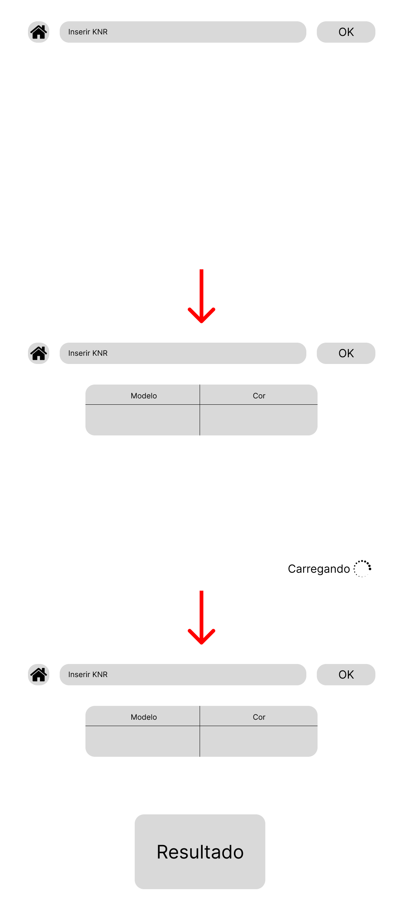
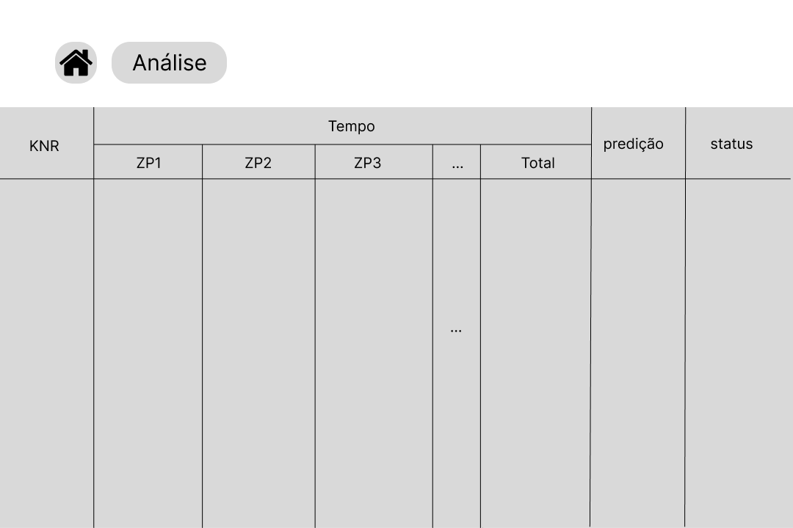
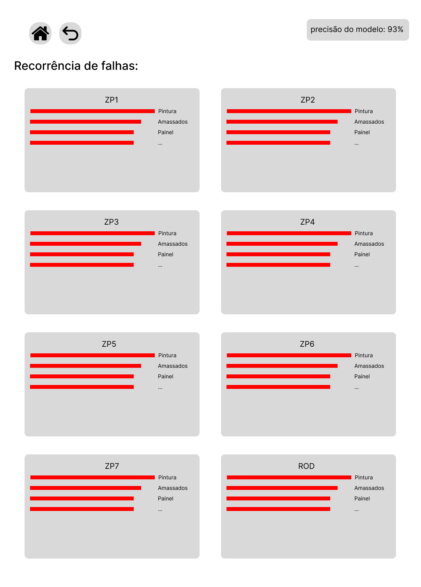

# Wireframe

## Definição

&emsp;Um wireframe é uma versão preliminar de uma interface de usuário. No contexto de desenvolvimento de uma aplicação web, o wireframe apresenta apenas a estrutura de cada página, definindo em qual parte ficará cada conteúdo planejado para a aplicação. Nele, não são inseridas cores, animações ou efeitos visuais, uma vez que o wireframe — em geral — está sujeito a várias alterações na etapa inicial de desenvolvimento e é adequado ter uma estrutura bem estabelecida antes de definir uma estilização.

&emsp;Diante do exposto, fica evidente que a confecção de um wireframe permite a produção de uma solução web melhor guiada e, por isso, a equipe It-Cross optou por desenvolver um wireframe. O wireframe foi desenvolvido através da plataforma Figma (disponível [aqui](https://www.figma.com/design/hYRK6OXtqpqyJJxDbqViPn/Wireframe?node-id=0-1&t=jYTmaFC5FExVFKS9-1)), de modo a considerar o uso da solução por duas personas (descritas em sua [respectiva seção](../../sprint-1/economia-circular/persona.md)), o que será detalhado a seguir:

## Fluxo da persona 1

&emsp;A parte do wireframe que representa o fluxo da persona 1 (técnica em fabricação mecânica e qualidade) se concentra em uma única página: a **página de predição**.

<b> Figura 1 - Wireframe do fluxo da persona 1: página de predição</b>

    
    
<b>Fonte:</b> Elaborado pela equipe It-Cross

&emsp;O intuito da página de predição é captar um KNR (dado de input que funciona como código de identificação de um determinado carro) do usuário e retornar a ele, visualmente, o output da análise do modelo preditivo a partir do dado KNR. Por isso, como se percebe na primeira parte do fluxo da figura 1, o wireframe desta página contém uma barra de input na parte superior. Além dela, há também um botão de "home", que deve redirecionar o usuário à tela inicial da aplicação web e um botão de "ok", que deve fazer com que KNR inserido pelo usuário seja encaminhado para a análise preditiva do modelo.

&emsp;Após pressionar "ok", o processo de predição deve iniciar e uma tabela com os dados preliminares do carro referente ao KNR inserido deve surgir. Os dados contidos nessa tabela devem ser dados que possibilitem que o usuário confirme que o KNR inserido realmente refere-se ao carro que ele está analisando no momento. Por isso, dados como "modelo" e "cor" do carro são interessantes de serem exibidos na tabela, uma vez que possibilitam essa confirmação visual. Além disso, um feedback de carregamento do processo de predição também deve ser dado ao usuário através de um ícone de carregamento no canto inferior direito da tela.

&emsp;Por fim, após a análise do modelo, o resultado da predição deve ser exibido na tela, como na terceira parte da figura 1. Tendo em vista que tal resultado é a informação de maior relevância na tela no contexto de uso da persona 1, a equipe It-Cross definiu que uma boa forma de inserí-la na página seria através de um grande card com o resultado descrito em palavra(s) curta(s) e com uma cor respectiva para cada resultado. Dessa forma, o usuário poderá visualizar e compreender o resultado do modelo com maior rapidez e facilidade.

## Fluxo da persona 2

&emsp;A equipe It-Cross também desenvolveu, no wireframe da solução, duas páginas referentes à utilização por parte da persona 2 (analista de qualidade), as quais constam nas figuras 2 e 3, a seguir.

<b> Figura 2 - Wireframe do fluxo da persona 2: página de histórico</b>

    
    
<b>Fonte:</b> Elaborado pela equipe It-Cross

&emsp;A primeira página, na figura 2, refere-se a um histórico que apresenta todos os dados e resultados de predição atrelados aos KNRs que foram submetidos à análise preditiva do modelo. A visualização desses dados deve ser através de uma tabela, uma vez que há uma grande quantidade de dados e uma tabela ampla permite uma visão holística de cada informação existente sobre cada KNR. Até o momento, é planejado que a linha que contém os títulos de cada coluna da tabela seja fixa e as demais linhas sejam *scrolláveis*, a fim de permitir a visualização de uma quantidade de dados que extrapola a capacidade vertical da interface.

&emsp;Ademais, na parte superior da página, há também dois botões: um que redireciona à homepage da aplicação e outro que redireciona à página de análise, ilustrada na figura 3.

<b> Figura 3 - Wireframe do fluxo da persona 2: página de análise</b>

    
    
<b>Fonte:</b> Elaborado pela equipe It-Cross

&emsp;A página de análise cumpre o papel de dashboard da solução. Nela, haverá uma série de cards referentes a cada um dos checkpoints da linha de produção de carros, nos quais haverá um gráfico de barras horizontais que permita ao usuário ver a recorrência de falhas por cada tipo de falha dentro de um checkpoint. Ademais, o canto superior direito da página contará com a precisão atual do modelo preditivo, o que, em conjunto com os gráficos, auxiliará o gerente de qualidade (usuário) na tomada de decisões na linha de produção — por exemplo, redirecionando a atenção dos trabalhadores para o checkpoint que apresenta maior número de falhas — e na utilização da solução em si, quando se trata da confiabilidade das predições desta.