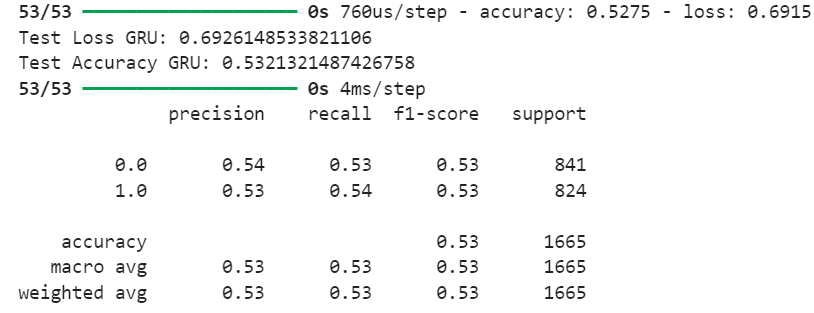
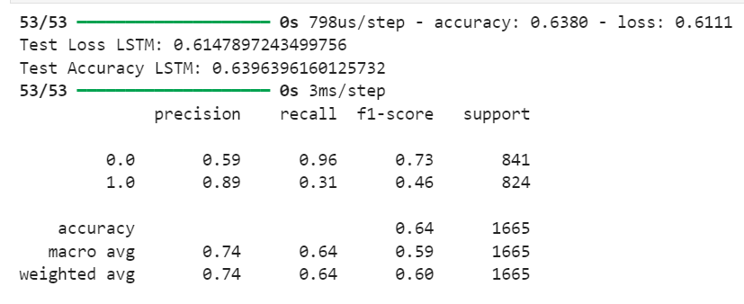
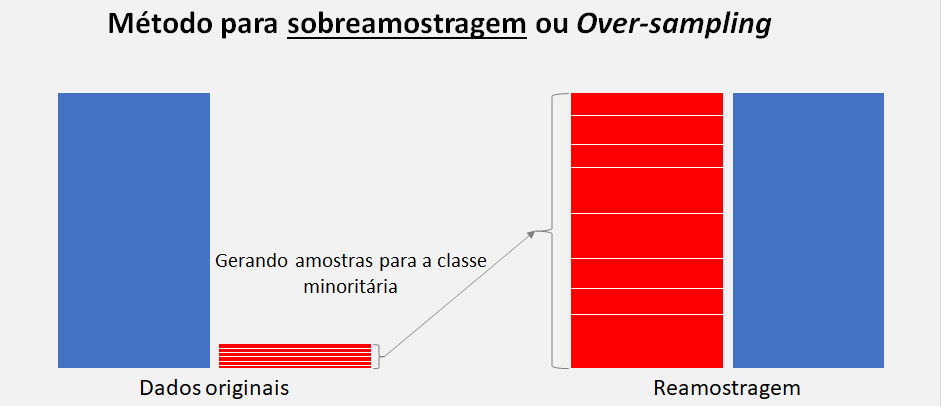
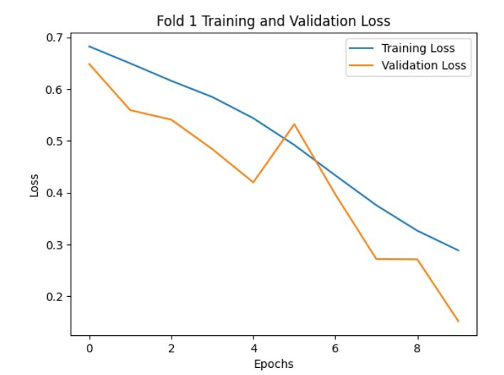
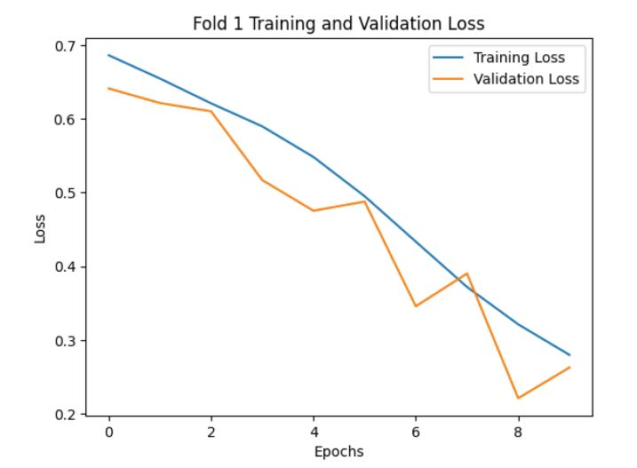

# Aprimoramento do modelo

&emsp;Esta seção aborda como o modelo preditivo desenvolvido pela equipe It-Cross até a sprint 2 foi aprimorado ao longo da sprint 3.

## Drop de colunas inutilizáveis

&emsp;Após a sprint review da sprint 2, a equipe foi informada de um detalhe relevante para o projeto: alguns dos checkpoints/halles referidos em algumas das colunas nas bases de dados fornecidas pelo Volkswagen para o desenvolvimento do modelo preditivo contemplam etapas posteriores ao teste de rodagem. Contudo, tais colunas estavam sendo utilizadas no treinamento, validação e teste do modelo desenvolvido, o que vai de desencontro com a proposta de solução da equipe, que envolve predizer qual o tipo ideal de testagem para determinado veículo **antes** do teste de rodagem, sendo incoerente o uso de dados posteriores a essa etapa em sua confecção.

&emsp;As colunas em questão são ``"ROD"``, ``"AGUA"``, ``"ZP8"`` e ``"ZP8R"``. Devido ao desconhecimento dessa informação, o modelo foi desenvolvido de modo a considerar tais colunas, o que conferiu a ele métricas de desempenho erroneamente elevadas em ambos os algoritmos de aprendizagem de máquina utilizados (GRU e LSTM). Após o conhecimento desta informação, as colunas em questões foram "dropadas" (desconsideradas) e a equipe iniciou um novo processo de treino, validação e testagem do modelo com base nos mesmos dois algoritmos, obtendo valores drasticamente reduzidos para as métricas, conforme exibido nas figuras 1 e 2.

Figura 1 - Métricas do modelo após drop das colunas desconsideradas (GRU)

Fonte: Elaborado pela equipe It-Cross

Figura 2 - Métricas do modelo após drop das colunas desconsideradas (LSTM)

Fonte: Elaborado pela equipe It-Cross

&emsp;À vista dessa redução, a equipe It-Cross idealizou possibilidades para elevar tais valores, a fim de que o modelo preditivo atendesse aos padrões de qualidades de um MVP adequado. Dentre as possibilidades, duas foram selecionadas como as mais ideais:

1. implementar novas *features*/colunas referentes ao tempo que cada veículo passou em cada checkpoint do processo de produção Volkswagen;
2. realizar a técnica de *oversampling* para aumentar a quantidade de dados disponíveis para treino do modelo.

## Implementação de novas features

&emsp;A primeira possibilidade de aprimoramento do modelo, referente à implementação de novas features, foi possível graças à tabela de dados `status` — que contém códigos de identificação e registros de tempo referentes às falhas ocorridas com cada veículo —, a qual foi fornecida pelo Volkswagen na primeira sprint de desenvolvimento do projeto. Tal tabela não foi utilizada pela equipe já no início do desenvolvimento pois a tabela continha códigos cujo significado era desconhecido para a equipe, situação que se reverteu posteriormente com novas informações repassadas pelo parceiro.

&emsp;A partir dessas novas informações, foi possível tratar a tabela status de modo a criar colunas que indicam quanto tempo cada veículo passou em cada checkpoint. Isso representa grande valor para o treinamento do modelo, uma vez que o fato de um carro ter passado tempo de mais ou de menos numa determinada etapa de sua produção pode indicar a existência de uma anomalia em sua fabricação. Por isso, tais colunas foram integradas ao dataframe utilizado para o treinamento do modelo.

## Fabricação de novos dados

&emsp;A fim de aprimorar o aprendizado do modelo quantitativamente, a equipe It-Cross optou por aumentar o número de dados disponível para tal. Para isso, foi usada a técnica de oversampling (ou sobreamostragem, em português), ilustrada na figura 1.

Figura 3 - Explicação da técnica de oversampling

Fonte: Elaborado por Dheiver Santos

&emsp;A técnica de oversampling consiste na geração de novos dados de uma classe que é minoritária dentro de uma base de dados. No caso deste projeto, a classe minoritária refere-se à classe de carros suscetíveis a falha, uma vez que, na linha de produção da Volkswagen, há muito mais carros sem falhas do que carros com falhas. Por isso, nas tabelas de dados fornecidas pelo parceiro, existem muito menos dados referentes a carros suscetíveis a falha, o que pode fazer com que o modelo consiga classificar adequadamente carros sem falha, mas não carros com falha.

&emsp;Diante do exposto, os dados de carros suscetíveis a falhas foram submetidos ao oversampling de tal maneira que novas linhas de dados sintéticos dessa classe foram geradas no dataframe de treino do modelo, igualando a quantidade de dados das diferentes classes. 

## Resultados

&emsp;Após essas etapas de tratamento de dados, o modelo foi treinado sem as colunas de checkpoints posteriores ao teste de rodagem, com as novas features de tempo despendido em cada checkpoint e com os novos dados sintéticos obtidos através do oversampling. Depois do treinamento tanto com o algoritmo GRU quanto com o algoritmo LSTM, o modelo foi submetido a teste e obteve uma acurácia de **98%** com ambos os algoritmos, o que representa um grande aumento em relação à acurácia anterior, de 54.0%.

&emsp;Como tal valor de acurácia é significativamente elevado, o modelo ainda foi submetido a um teste de validação cruzada, técnica que considera vários subconjuntos diferentes da base de dados do modelo para treiná-lo e/ou testá-lo. Com o uso desta técnica, o modelo apresentou acurácia de **94.9%** (tanto com o algoritmo GRU quanto com o algoritmo LSTM) e valores de perda que podem ser conferidos nas figuras 4 e 5, a seguir.

Figura 4 - Variação de perda do modelo (GRU)

Fonte: Elaborado pela equipe It-Cross

Figura 5 - Variação de perda do modelo (LSTM)

Fonte: Elaborado pela equipe It-Cross

&emsp;Ambos os gráficos, referentes a cada um dos dois algoritmos usados, sinalizam que a perda de treino e validação convergem para baixo a cada época de treinamento do modelo, além de que a diferença entre ambas nunca é expressiva. Estes fatores indicam que o modelo não apresenta overfitting ou, em outras palavras, que ele não está sobre-adequado aos dados de treino. Contudo, ainda é possível que existam mais maneiras de elevar a acurácia do modelo e aprimorar seu desempenho, o que será verificado nas demais sprints de desenvolvimento da solução.