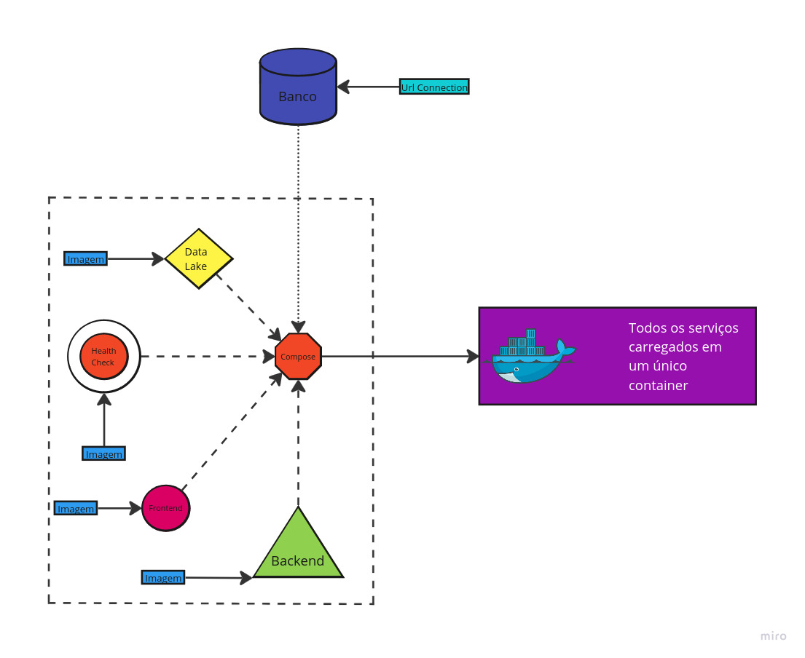

# Dockerizando a aplicação

## Introdução: O que é Docker?

&emsp;Docker é uma plataforma de virtualização leve que utiliza contêineres para empacotar e distribuir software. Os contêineres são isolados uns dos outros e contêm o software, as bibliotecas e as dependências necessárias para que ele funcione. Além disso, esses contêineres podem se comunicar uns com os outros por meio de canais bem definidos, garantindo a interoperabilidade. Todos os contêineres compartilham o mesmo kernel do sistema operacional, o que os torna mais eficientes em comparação com máquinas virtuais tradicionais.

## Por que utilizamos em nossa aplicação?

&emsp;Em nossa aplicação, utilizamos o Docker para garantir a consistência do ambiente de desenvolvimento, facilitar o gerenciamento de dependências e simplificar a implantação. O Docker também possibilita que nossos serviços sejam executados de forma isolada, mas com capacidade de comunicação eficiente entre eles. Isso é fundamental para manter a modularidade e escalabilidade do sistema.

## Como configurar (ambiente Linux)

&emsp;Para configurar o Docker em um ambiente Linux, siga os seguintes passos:

**1 -** Instale o Docker:

```python
sudo apt-get update
sudo apt-get install docker-ce docker-ce-cli containerd.io
```

**2 -** Instale o Docker Compose:

```python
sudo curl -L "https://github.com/docker/compose/releases/download/v2.0.0/docker-compose-$(uname -s)-$(uname -m)" -o /usr/local/bin/docker-compose
sudo chmod +x /usr/local/bin/docker-compose
```

**3 -** Verifique a instalação:

```python
docker --version
docker-compose --version
```

**4 -** Inicie o Docker:

```python
sudo systemctl start docker
sudo systemctl enable docker
```

## Aplicação em nosso projeto:

&emsp;A imagem abaixo representa visualmente, por meio de uma Arquitetura, a implementação do Docker em nossa aplicação. Nela, estão destacados os principais serviços e suas interconexões. A leitura atenta da legenda facilitará a compreensão de como esses serviços se relacionam.

<p align="center"><b> Figura 1 - Figura arquitetura Docker</b></p>
<div align="center">
  
  <p><b>Fonte:</b> Elaborado por IT-CROSS</p>
</div>

### Label's

- `Imagem:` Representa uma parte da dockerização. Cada label desse tipo aponta para um serviço da nossa aplicação, que tem uma imagem gerada e gerenciada pelo Docker-Compose.

- `Url Connection:` Indica que o serviço está hospedado externamente, por exemplo, em uma solução de nuvem, e que está se conectando à aplicação por meio de uma variável de ambiente configurada no Docker-Compose.

### Serviços

- `Backend:` É uma imagem que aponta para o serviço backend no Docker-Compose. Essa imagem contém a API do projeto, responsável por lidar com a lógica de negócios e a comunicação com o banco de dados.

- `Frontend:` É uma imagem que aponta para o serviço frontend no Docker-Compose. Essa imagem contém a interface visual do projeto, a qual será utilizada pelo cliente.

- `Data Lake:` É uma imagem que aponta para o serviço de Data Lake no Docker-Compose. Esse serviço é responsável por armazenar grandes volumes de dados, sejam eles relacionais ou não, que serão utilizados pela aplicação.

- `Health Check:` É uma imagem que monitora os serviços da aplicação. Ele realiza verificações periódicas para assegurar que todos os serviços estão funcionando corretamente e dispara alertas em caso de falhas.

### Serviços do Docker

- `Compose:` O arquivo **docker-compose.yml** é responsável por orquestrar todos os serviços da nossa aplicação. Ele configura e executa os contêineres, além de possibilitar a comunicação entre os diferentes serviços em um ambiente isolado e controlado.

- `Container:` O Container representa a fase final do processo de dockerização. Ele é um serviço mais abstrato e integrado, onde todos os componentes da aplicação (Backend, Frontend, Data Lake, etc.) se conectam. A partir desse ponto, é possível hospedar a aplicação por completo, unificando os serviços e facilitando o gerenciamento e a escalabilidade.

## Trechos de código relevantes para a aplicação:

&emsp;Nessa seção, exploramos as imagens que criamos para cada serviço da aplicação e explicamos como o orquestrador `Docker-Compose.yml` funciona. A seguir, estão as imagens associadas ao **backend**, **frontend** e **health-check**, além da configuração de serviços no Docker Compose.

### Imagens

**1 -** Imagem do backend:

- Baseada na imagem oficial do Python 3.10.

- Define o diretório de trabalho (`/app`) dentro do contêiner.

- Copia o arquivo `requirements.txt` e instala as dependências necessárias com `pip`.

- Copia o restante do código para o contêiner.

- Expõe a porta 3000 para acessar o serviço da API.

- Utiliza `uvicorn` para iniciar a API no FastAPI.

```python
    FROM python:3.10

    WORKDIR /app

    COPY requirements.txt ./

    RUN pip install --no-cache-dir -r requirements.txt

    COPY . .

    EXPOSE 3000

    CMD ["uvicorn", "main:app", "--host", "0.0.0.0", "--port", "3000"]
```

**2 -** Imagem do frontend:

- Baseada na imagem oficial do Node.js versão 20.

- Define o diretório de trabalho (`/app`).

- Copia os arquivos `package*.json` para instalar as dependências necessárias com o `npm install`.

- Copia o código do frontend para dentro do contêiner.

- Executa o comando `npm run build` para gerar os arquivos de build da aplicação frontend.

- Expõe a porta 3000 para servir a aplicação frontend.

- Utiliza `npm start` para iniciar o serviço.

```python
    FROM node:20

    WORKDIR /app

    COPY package*.json ./

    RUN npm install

    COPY . .

    RUN npm run build

    EXPOSE 3000
    
    CMD ["npm", "start"]
```

**3 -** Imagem do health-check:

- Também baseada na imagem do Python 3.10.

- Semelhante à imagem do backend, mas voltada para realizar verificações de integridade nos serviços.

- Expõe a porta 5000 para monitoramento.

- Utiliza `uvicorn` para iniciar um serviço FastAPI que executa a verificação de integridade.

```python
    FROM python:3.10

    WORKDIR /app

    COPY requirements.txt ./

    RUN pip install --no-cache-dir -r requirements.txt

    COPY . .

    EXPOSE 5000
    
    CMD ["uvicorn", "main:app", "--host", "0.0.0.0", "--port", "5000"]
```

**4 -** Imagem do MinIO:

&emsp;Diferente dos outros serviços, o MinIO utiliza uma imagem pré-existente diretamente do repositório oficial do Docker Hub, sem a necessidade de um Dockerfile personalizado. Essa abordagem é adotada porque o MinIO já oferece uma imagem otimizada e pronta para uso, o que simplifica a configuração e agiliza o processo de desenvolvimento.

&emsp;A imagem oficial do MinIO já inclui todas as dependências necessárias para o funcionamento do serviço de armazenamento em nuvem local. Além disso, por se tratar de uma ferramenta amplamente utilizada, a imagem oficial é constantemente atualizada e mantida pela comunidade, o que garante segurança e estabilidade. No docker-compose.yml, configuramos o MinIO para expor as portas necessárias (9000 e 9001) e utilizamos variáveis de ambiente para definir o usuário root e a senha de acesso, garantindo um controle fácil sobre a autenticação e segurança do serviço.

### Docker-Compose

&emsp;O arquivo `docker-compose.yml` orquestra todos os serviços da aplicação, permitindo a comunicação entre eles. Aqui, detalhamos os serviços principais:

```python
services:
  frontend:
    build: ./frontend
    image: src/frontend
    restart: unless-stopped
    environment:
      NEXT_PUBLIC_BACKEND_URL: "http://backend:3000"
    ports:
      - "3000:3000"
    container_name: itcross-frontend

  backend:
    build: ./backend
    image: src/backend
    restart: unless-stopped
    environment:
      DATABASE_URL: ${DATABASE_URL}
    ports:
      - "3001:3000"
    container_name: itcross-backend
    env_file:
      - .env
    volumes:
      - ./backend:/app/backend  

  minio:
    image: minio/minio
    container_name: itcross-minio
    environment:
      MINIO_ROOT_USER: ${USER_MINIO}
      MINIO_ROOT_PASSWORD: ${PASSWORD_MINIO}
    volumes:
      - ./minio/data:/data
    ports:
      - "9000:9000"
      - "9001:9001"
    command: server /data --console-address ":9001"
    restart: unless-stopped

  health:
    build: ./health
    image: src/health
    restart: unless-stopped
    depends_on:
      - frontend
    ports:
      - "5000:5000"
    container_name: itcross-health
    volumes:
      - ./backend:/app/backend  
      - ./health:/app/health    
    environment:
      SUPABASE_URL: ${SUPABASE_URL}
      SUPABASE_KEY: ${SUPABASE_KEY}
    env_file:
      - .env
    healthcheck:
      test: ["CMD", "curl", "-f", "http://itcross-health:5000/health?m=m"]  
      interval: 30s
      timeout: 10s
      retries: 5
      start_period: 30s
```

### Explicação dos Serviços no Docker Compose

- Frontend:
        - A imagem do frontend é criada e exposta na porta `3000`. 
        - A URL do backend é passada como uma variável de ambiente `NEXT_PUBLIC_BACKEND_URL`.

- Backend:
        - O serviço de backend é responsável pela API da aplicação e está exposto na porta `3001` para comunicações internas, mas acessa-se pela porta `3000` no contêiner. 
        - O arquivo `.env` é utilizado para passar variáveis sensíveis como a `DATABASE_URL`.

- MinIO:
        - Um serviço de armazenamento em nuvem local, utilizando o MinIO. Ele usa a porta `9000` para a API e `9001` para o console administrativo.
        - Os dados são montados em um volume persistente no caminho `./minio/data`.

- Health Check:
        - Um serviço para verificar a saúde dos componentes da aplicação. Ele usa a porta `5000` para expor um endpoint de verificação de integridade. Esse serviço depende do Frontend estar ativo para subir.
        - O comando `healthcheck` monitora o serviço periodicamente e define o comportamento em caso de falhas de integridade.

## Conclusão

&emsp;A utilização do Docker para a nossa aplicação proporcionou inúmeros benefícios, desde a consistência no ambiente de desenvolvimento até a facilidade na implantação e escalabilidade. Ao encapsular os diferentes serviços da aplicação em contêineres, conseguimos garantir a modularidade, o isolamento e a interoperabilidade dos componentes, tudo isso com um gerenciamento eficiente de dependências.

&emsp;A estrutura criada com Docker Compose orquestra de maneira simples e eficaz os serviços de backend, frontend, health-check e armazenamento de dados, permitindo uma comunicação transparente entre eles e facilitando o monitoramento e a manutenção da aplicação. Com essa configuração, a equipe é capaz de focar mais na evolução do projeto e menos nas complexidades relacionadas ao ambiente, garantindo uma maior produtividade e qualidade no desenvolvimento.