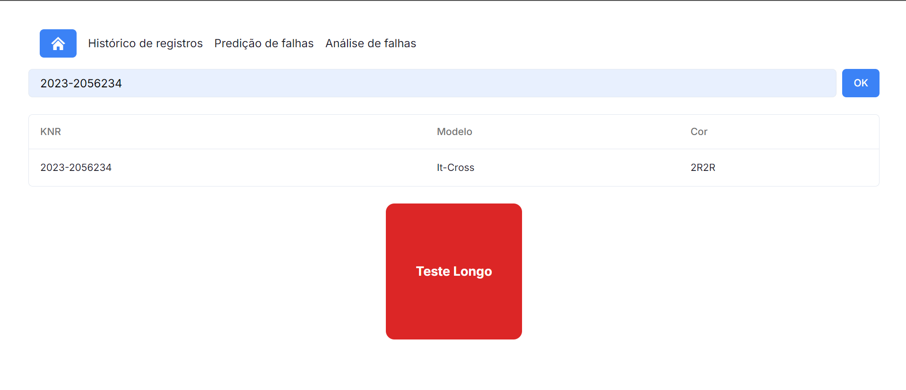

# Frontend

## 1. Introdução
&nbsp;&nbsp; As principais mudanças no frontend da aplicação, ou seja, as páginas que o usuário irá interagir, foram em relação à unificação da identidade visual da aplicação, a integração com o backend nas páginas de histórico e análise e adição de uma página inicial. Em relação às tecnologias, foi utilizado o framework Next,js e a unificação dos componentes pra a biblioteca `shacdnui`, que possui elementos simples e funcionais, facilitando o desenvolvimento do código e com uma estética agradável. Cada mudança será detalhada abaixo, com a descrição do processo e as justificativas de cada escolha. Além disso, serão apresentados novos passos e possíveis melhorias para a próxima sprint.

## 2. Integração com o backend

&nbsp;&nbsp; A integração com o backend foi feita nas páginas de histórico e análise, para que o usuário possa visualizar os dados reais da Volkswagen. A integração foi feita utilizando o fetch API, que é uma API nativa do JavaScript para fazer requisições HTTP. A integração foi feita de forma assíncrona, para que o usuário possa visualizar os dados em tempo real. Segue o código exemplo da rota para a página de histórico para a integração com o backend:

```javascript
useEffect( () => {
    fetch(`http://${window.location.hostname}:8000/getHistory`)
      .then((res) => res.json())
      .then((data) => {
        setData(data);
        setLoading(false);
        setProgress(100);
      })
  }, [])
```

## 3. Página Inicial


### 3.1 Mudanças

&nbsp;&nbsp; A página inicial foi criada para que o usuário possa ter uma visão geral do que a aplicação oferece, poder navegar entre as diferentes páginas e ter um contexto inicial sobre a aplicação. Nela, é possível visualizar o espaço para uma pequena descrição sobre o projeto e os botões para navegar para as páginas de predição, histórico e análise, dando a possibilidade do usuário de navegar pelo cabeçalho ou pelos botões. Inclusive, o botão de predição foi estilizado para chamar a atenção do usuário, com uma cor mais forte para conduzi-lo a navegar para a página com maior ocorrência de uso.

### 3.2 Próximos passos 

&nbsp;&nbsp; Para a próxima sprint, será adicionada uma descrição detalhada sobre o projeto, bem como a adição do botão de análise dentre os outros botões apresentados abaixo e um estudo de cores ehierarquia da informação para a página inicial, para que a aplicação seja mais atraente e intuitiva para o usuário.


## 4. Página de predição



### 4.1 Mudanças

&nbsp;&nbsp;A página de predição já havia sido integrada com o backend na sprint passada. Porém, a principal alteração que ocorreu foi a adição do cabeçalho, permitindo que o usuário possa navegar entre as páginas de forma mais intuitiva, e a validação do input para predição, que precisa estar no formato "0000-0000000" para buscar o KNR no banco de dados, processar no modelo e retornar a predição. Além disso, após a predição, o input é limpado para que ele possa predizer outro KNR sem precisar apagar o input.

### 4.2 Próximos passos

&nbsp;&nbsp; Para a próxima sprint, haverá um estudo para reformulação do formato de apresentação do output, de forma que seja mais claro para o usuário o resultado da predição, dado o contexto de uso serem motoristas com vários carros a serem testados e precisam demandam pouco foco na tela para que o processo de teste seja agilizado. Assim, será feito um blur teste, para que, mesmo com a página desfocada, o usuário consiga identificar o resultado da predição pode meio de cores e elementos. Além disso, a tabela com informações sobre o carro serão atualizadas para exibir apenas o necessário para o usuário identificar o carro predito.


## 5. Página de Histórico


### 5.1 Mudanças

&nbsp;&nbsp; A página de histórico foi alterada principalmente no design e na integração com o backend. O design foi alterado para seguir a identidade visual da aplicação e o cabeçalho foi adicionado, possibilitando navegar diretamente para outras páginas. A integração com o backend foi feita para que a página possa exibir os dados de histórico que estão armazenados no banco de dados, permitindo que o usuário possa visualizar os KNRs produzidos na fábrica. O sistema conta com uma página de carregamento para fornecer feedback ao usuário enquanto os dados são carregados do backend.Além disso, a página foi estilizada para que o usuário possa visualizar as informações de forma clara e intuitiva.


### 5.2 Próximos passos

&nbsp;&nbsp; As principais mudanças a serem feitas na próxima sprint é em relação ao design da página e às cores para representação das informações, que será reformulado para que o usuário possa visualizar as informações de forma mais clara e intuitiva. Por exemplo, nas células de predição e resultado do teste, serão adicionadas cores verde e vermelho para destacar melhor para o usuários os carros com falhas e demandar menos carga cognitiva para processar as informações. Além disso, será feita uma análise para adicionar filtros de busca e ordenação, para que o usuário possa encontrar as informações de forma mais rápida e eficiente. 


## 6. Página de análise


### 6.1 Mudanças

&nbsp;&nbsp; A página de análise foi alterada na forma de apresentação das falhas por halle, o cabeçalho foi adicionado e a página foi integrada com o backend para apresentar as informações reais sobre as falhas da volkswagen. A página foi estilizada para que o usuário possa visualizar as informações de forma clara e intuitiva por meio de cards de cada halle exibindo as falhas com barras indicando cada tipo de falha e o percentual de falhas totais.

### 6.2 Próximos passos

&nbsp;&nbsp; Para a próxima sprint, será feita uma análise para modificar as cores das barras conforme o percentual de falhas, para que o usuário possa identificar as falhas mais críticas de forma mais rápida e eficiente, e adicionar marcas de pencentual ao longo da barra, para facilitar a comparação entre falhas do usuário. Além disso, será feita uma análise para adicionar filtros de data para que as falhas apresentadas seja de um período específico e não as falhas totais, para que o usuário possa analisar as falhas de forma mais detalhada e específica. Além disso, é necessário integrar o card de percentual de performance do modelo com o backend, para que o usuário possa visualizar as informações reais sobre a performance do modelo em relação aos carros preditos e o resultado em seu teste.


## 7. Como executar

Para executar o frontend da aplicação, siga os passos abaixo:

1. Clone o repositório:

```bash  
git clone https://github.com/Inteli-College/2024-2A-T08-EC07-G05.git
```

2. Acesse a pasta do frontend:

```bash
cd src/frontend
```

3. Instale as dependências:

```bash
npm install
```

4. Execute a aplicação:

```bash
npm run dev
```

## 8. Conclusão

Para a próxima sprint, as principais alterações serão em relação ao design das páginas, para que o usuário possa visualizar as informações de forma mais clara e intuitiva, e a adição de filtros de busca e ordenação, para que o usuário possa encontrar as informações de forma mais rápida e eficiente. Além disso, o cabeçalho será alterado para ter uma estética mais similar ao resto da aplicação.Portanto, serão realizados alguns testes para validar as mudanças e garantir que a aplicação esteja atendendo às necessidades dos usuários. Porém, atualmente a página se encontra funcional e integrada com o backend, permitindo que o usuário possa realizar as principais funcionalidades propostas pela solução. Em suma, os próximos passos serão focados em melhorar a experiência do usuário e refinar detalhes da aplicação.