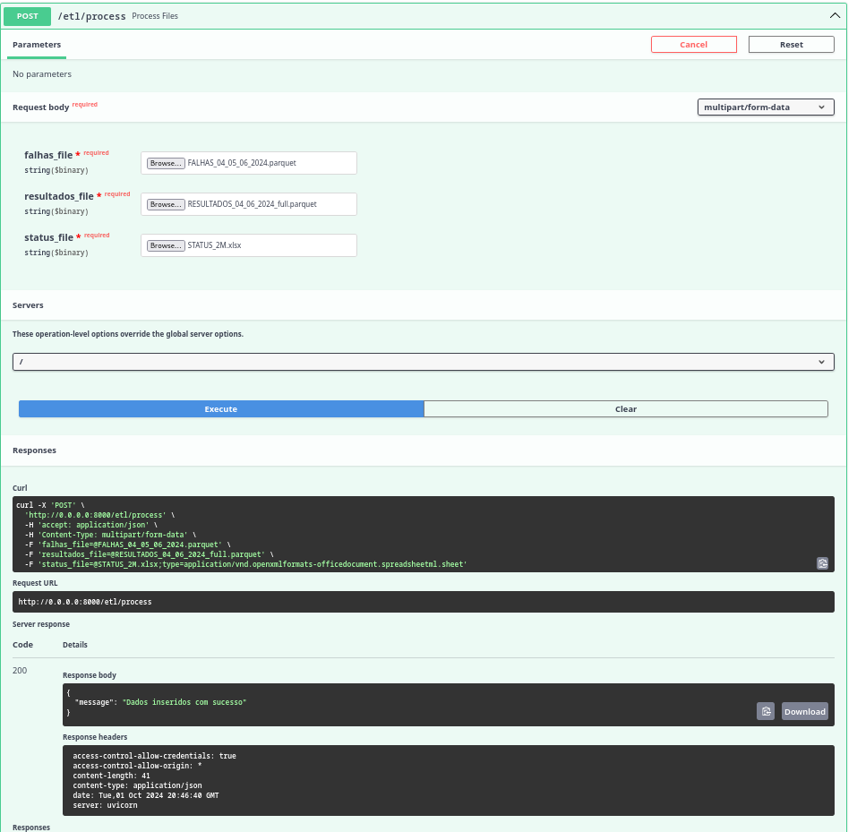

## Introduçao

O ETL (Extract, Transform, Load) é o processo que consiste no carregamento de dados do treinamento do modelo. As três etapas do ETL são:
- Extração: Os dados são coletados de forma crua via API, podendo ser de diversos formatos, tais como csv, xlsx, parquet e outros. Esta etapa visa consolidar todos os dados necessários para que o processo de transformação possa ocorrer com êxito.
- Transformação: Após serem coletados, os dados passarão por um rigoroso processo de tratamento para serem disponibilizados para o treinamento de novos modelos.
- Carregamento: Com o tratamento feito, os dados são carregados para nosso banco de dados, assim ficando disponíveis para os serviços de treinamento.

Nosso serviço realiza uma implementação prática, permitindo o desenvolvimento e comparação de novos modelos sem nenhum processo de tratamento prévio.

## Implementação

Quando os arquivos são inseridos, funções internas são chamadas, responsáveis por carregar os dados conforme o tipo de arquivo (CSV, XLSX, JSON, Parquet, TXT), garantindo a flexibilidade na ingestão dos dados. Essa etapa inicial é realizada em todas as funções de tratamento.

```python
if path.endswith('.csv'):
    df_resultados = pd.read_csv(path)
elif path.endswith('.xlsx') or path.endswith('.xls'):
    df_resultados = pd.read_excel(path)
elif path.endswith('.json'):
    df_resultados = pd.read_json(path)
```

Depois de carregar os dados, ocorre o tratamento das colunas. Colunas desnecessárias são removidas e algumas são renomeadas para proporcionar mais clareza, utilizando `drop` e `rename` para padronizar o formato dos dados:

```python
df_resultados = df_resultados.drop('Unnamed: 0', axis=1)
df_resultados = df_resultados.rename(columns={
    'Unnamed: 1': 'KNR',
    'Unnamed: 2': 'NAME',
    'Unnamed: 3': 'ID',
    'Unnamed: 4': 'STATUS',
    ...
})
```
Após todas as rotinas de tratamento, os dados são unidos e carregados para o banco de dados, já estando tratados e disponíveis para serem utilizados no treinamento de novos modelos.

## Endpoint

### POST `/etl/process`

**Descrição:** Processa e insere arquivos de dados no banco de dados, preparando-os para o treinamento de modelos.

**Parâmetros de Entrada:**
- `falhas_file`: Arquivo contendo dados de falhas (aceita formatos CSV, XLSX, JSON, Parquet, TXT).
- `resultados_file`: Arquivo contendo os resultados (aceita formatos CSV, XLSX, JSON, Parquet, TXT).
- `status_file`: Arquivo contendo informações de status (aceita formatos CSV, XLSX, JSON, Parquet, TXT).

**Resposta:**
- **Código 200**: Indica que os dados foram inseridos com sucesso.




## Conclusão

Com a interface desenvolvida pelo grupo IT-CROSS, o processo de teste e desenvolvimento de novos modelos torna-se simples, ágil e acessível, eliminando a complexidade e facilitando a constante melhora da solução.
