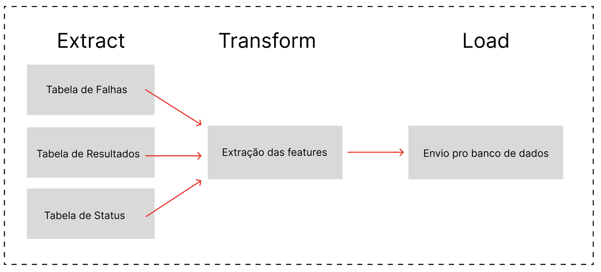

# Processo de ETL

## Importância do ETL no Projeto

No projeto de predição de falhas, o processo de ETL (Extract, Transform, Load) desempenha um papel essencial. Ao longo da linha de produção, os carros vão gerando novos dados que o nosso modelo, ao chegar no checkpoint ROD, realiza uma predição com eles. 

Porém, esses dados que chegam a cada instante também são valiosos para futuras melhorias e treinamentos de novos modelos, além de permitirem ajustes e novas análises. O ETL é utilizado para coletar esses dados preditivos, transformá-los conforme necessário e armazená-los de forma adequada no banco de dados, garantindo que estejam disponíveis para uso posterior.

## O que é o ETL

ETL é uma sigla para **Extract, Transform, Load**, que são as três etapas principais do processo de integração de dados. Esse processo envolve:

- **Extract (Extração)**: Coleta de dados brutos de uma ou mais fontes.
- **Transform (Transformação)**: Limpeza e transformação dos dados para que eles se adequem aos requisitos de uso, como a remoção de ruídos ou a criação de novas features a partir dos dados brutos.
- **Load (Carregamento)**: Carregamento dos dados processados em um banco de dados ou outro sistema de armazenamento para serem utilizados por sistemas analíticos, como o modelo de predição.

Esse fluxo é crucial para garantir que os dados coletados da linha de produção sejam armazenados corretamente e estejam prontos para futuras análises e modelagens.

## Como Funciona o Processo de ETL no Projeto

No projeto de predição de falhas, o processo de ETL segue o fluxo básico de extração de dados dos diferentes sistemas de monitoramento da linha de produção, transformação para criar features úteis e carregamento em um banco de dados.

### Fases do Processo ETL

1. **Extract (Extração)**:
   - O processo começa com a coleta de três tipos de dados armazenados em tabelas específicas:
     - **Tabela de Falhas** (eventos de falhas registradas dos carros).
     - **Tabela de Resultados** (resultados das operações feitas em cada carro).
     - **Tabela de Status** (informações sobre o status geral da linha de produção).
   
2. **Transform (Transformação)**:
   - Após a extração, os dados passam por uma fase de transformação, obtida a partir da exploração dos dados e da percepção do grupo ao longo do desenvolvimento de quais features contribuem para uma melhor performance do modelo. Essas features podem incluir variáveis como a quantidade de carros que passaram sem falhas, o tempo entre falhas, a quantidade de operações OK, e outros parâmetros úteis para o aprimoramento do modelo de predição.

3. **Load (Carregamento)**:
   - Finalmente, os dados transformados são carregados no banco de dados. Esse banco de dados será utilizado para armazenar o histórico de resultados e falhas, podendo ser usado futuramente para treinar novos modelos de predição.

## Processo de ETL no Frontend

O processo de ETL no projeto também conta com uma interface simples e intuitiva no frontend. A página de dados permite que o usuário envie os arquivos necessários para realizar a ETL de maneira automática.

### Página de Dados

Na **Página de Dados**, o usuário pode visualizar a quantidade de datasets adicionados ao sistema e enviar novos arquivos para o pipeline de ETL. A interface mostra os datasets já existentes, suas datas de adição e a quantidade de carros presentes em cada dataset.

### Envio de Arquivos

Para iniciar o processo de ETL, o usuário deve clicar no botão "Enviar Arquivos", que abrirá um modal onde ele poderá fazer o upload dos arquivos Excel necessários:
- **Arquivo de Falhas** (registros de falhas identificadas).
- **Arquivo de Resultados** (resultados de predições anteriores).
- **Arquivo de Status** (status da linha de produção).

Depois de selecionar os arquivos, o usuário clica em "Enviar Arquivos" para que o sistema inicie o processo de ETL. Assim que os dados forem extraídos e transformados, eles serão carregados no banco de dados, ficando disponíveis para uso em futuras análises.

### Novo Modelo

Após a adição de novos dados, o usuário tem a opção de criar um novo modelo de predição, treinado com as informações todas informações: antigas e as recém-carregadas. O botão "Novo Modelo" redireciona para a página de criar novos modelos. Lá, é possível iniciar esse processo diretamente da interface do frontend.

## Conclusão

O processo de ETL no projeto de predição de falhas é essencial para garantir que os dados coletados na linha de produção sejam utilizados para novos modelos. Esses dados são transformados em informações úteis e armazenados de forma adequada, garantindo a possibilidade de melhorias contínuas no modelo de predição. A integração com o frontend facilita a manipulação dos dados pelo usuário, oferecendo uma interface clara e direta para o envio e processamento dos arquivos necessários.