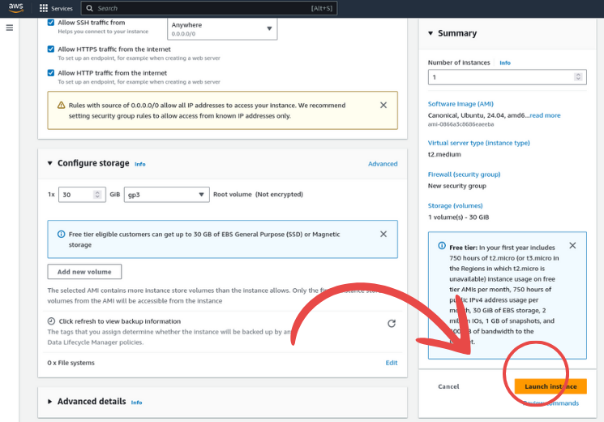

# Processo de deploy do projeto 

&emsp;Para garantir a acessibilidade e entrega do projeto, é essencial realizar o deploy da aplicação. Isso significa disponibilizar o projeto em um ambiente de nuvem, onde ele pode ser acessado e utilizado por todos os usuários, assegurando que a aplicação funcione além do ambiente local e esteja disponível globalmente.

## O que é deploy de uma aplicação e sua finalidade

&emsp;O deploy de uma aplicação é o processo de mover um projeto do ambiente de desenvolvimento local para um ambiente de produção, permitindo que ele seja acessado por usuários reais. Durante o desenvolvimento, os projetos geralmente são executados localmente nas máquinas dos desenvolvedores. No entanto, à medida que o projeto avança, é necessário garantir que ele possa operar de forma eficiente em uma infraestrutura escalável e acessível a diversos usuários.

&emsp;O principal objetivo do deploy é validar a capacidade da aplicação de lidar com o tráfego real, garantir que todas as funcionalidades estão integradas corretamente e que o sistema possa escalar conforme a demanda. Além disso, o deploy coloca a solução em seu estágio final, permitindo que ela fique acessível ao público, simulando as condições reais de uso — algo fundamental para testar a robustez e a resiliência do produto.

## Por que estamos utilizando AWS

&emsp;Optamos por utilizar a AWS (Amazon Web Services) como plataforma de deploy devido à sua robustez e à ampla adoção no mercado. A AWS oferece uma gama de serviços integrados que facilitam o gerenciamento e a implementação de aplicações, desde a configuração de servidores até a gestão de banco de dados e escalabilidade automatizada.

&emsp;Além disso, o Inteli possui uma parceria institucional com a AWS, permitindo o uso de seus serviços gratuitamente em determinados níveis. Isso facilita o aprendizado e familiarização com a plataforma sem custos adicionais. A AWS é amplamente utilizada no mercado de trabalho, e dominar suas ferramentas e serviços aumenta nossa competitividade profissional.

## Instância EC2: Como configurar

&emsp;A **EC2 (Elastic Compute Cloud)**  é o serviço de máquinas virtuais da AWS que permite criar e configurar servidores para hospedar sua aplicação. A seguir, estão os principais passos para configurar uma instância EC2.

&emsp;Antes de continuar, entre no espaço da plataforma dedicado a instância EC2, dentro desse ambiente que iremos construir o deploy da aplicação:

<p align="center"><b> Figura 1 - Figura inicial setup EC2</b></p>
<div align="center">
  
  <p><b>Fonte:</b> Elaborado por IT-CROSS</p>
</div>

<p align="center"><b> Figura 2 - Figura launch EC2</b></p>
<div align="center">
  
  <p><b>Fonte:</b> Elaborado por IT-CROSS</p>
</div>

&emsp;**1 - Escolher a AMI (Amazon Machine Image):** A AMI é a imagem base que define o sistema operacional e outras configurações iniciais. É possível selecionar distribuições como Ubuntu, Amazon Linux, ou até imagens personalizadas, dependendo das necessidades do projeto. Estamos utilizando a imagem do ubuntu. É necessário que seja configurado o docker nesse novo sistema operacional, portanto, acesse a documentação do projeto onde mostramos de como realizar a [configuração desse setup](https://inteli-college.github.io/2024-2A-T08-EC07-G05/docker).

<p align="center"><b> Figura 3 - Figura configuração AMI</b></p>
<div align="center">
  
  <p><b>Fonte:</b> Elaborado por IT-CROSS</p>
</div>

&emsp;**2 - Selecionar o tipo de instância:** Defina o tamanho e a capacidade da máquina virtual com base nas necessidades da aplicação. Tipos como `t2.micro` ou `t3.micro` são ideais para pequenos projetos em fase de testes. No entanto, para garantir que o **sistema de machine learning** em nosso projeto seja eficiente o suficiente para ser re-treinado, estamos utilizando o tipo de instância `t2.medium`, que oferece maior capacidade de processamento.

<p align="center"><b> Figura 4 - Figura tipo da instância</b></p>
<div align="center">
  
  <p><b>Fonte:</b> Elaborado por IT-CROSS</p>
</div>

&emsp;Nesse passo iremo configurar o acesso e visibilidade da máquina, portanto, selecione conforme mostra na imagem abaixo:

<p align="center"><b> Figura 5 - Figura HTTP permissões</b></p>
<div align="center">
  
  <p><b>Fonte:</b> Elaborado por IT-CROSS</p>
</div>

&emsp;**3 - Configurar o armazenamento:** Determine o volume de armazenamento necessário para a sua instância. Embora o armazenamento padrão da AWS seja suficiente para muitos projetos, você pode personalizar essa configuração de acordo com as necessidades específicas. Em nosso projeto, configuramos o limite de armazenamento para **30 GB,** o que consideramos suficiente para armazenar dados do sistema e possibilitar futuras expansões.

<p align="center"><b> Figura 6 - Figura armazenamento da máquina</b></p>
<div align="center">
  
  <p><b>Fonte:</b> Elaborado por IT-CROSS</p>
</div>

&emsp;**4 - Acessar a instância via SSH:** Após a configuração inicial, utilize o comando SSH no terminal para acessar a instância e começar a configurar o ambiente da aplicação. Isso inclui:

- Instalar dependências necessárias.
- Configurar variáveis de ambiente.
- Garantir que o ambiente esteja pronto para o deployment final.

<p align="center"><b> Figura 11 - Figura Connection SSH</b></p>
<div align="center">
  
  <p><b>Fonte:</b> Elaborado por IT-CROSS</p>
</div>

&emsp;Após conectar-se à instância, siga os próximos passos para assegurar que a chave SSH está corretamente configurada no caminho em que você está executando o comando.

&emsp;Certifique-se de que sua chave de acesso está no local correto e execute o comando no terminal da seguinte forma (execute o seu comando, esse de exemplo é o que utilizamos para acessar nossa máquina):

```
ssh -i "itcross.pem" ubuntu@ec2-3-87-183-194.compute-1.amazonaws.com
```

<p align="center"><b> Figura 12 - Figura Connection SSH</b></p>
<div align="center">
  
  <p><b>Fonte:</b> Elaborado por IT-CROSS</p>
  > Nota: É necessário que a private key esteja baixada e alocada no caminho correto em que você vai executar esse comando no terminal.
</div>
 

&emsp;**5 - Configurar as permissões de segurança (Security Groups):** Defina as regras de segurança para a instância, configurando as portas de entrada e saída. Por exemplo, a porta **22** é usada para SSH, enquanto as portas **80** e **443** são comumente usadas para tráfego HTTP/HTTPS. Em nossa aplicação, estamos utilizando a porta **80** para o frontend, **3000** para o backend, e **5000** para o sistema de saúde, garantindo a comunicação eficiente entre os diferentes componentes do projeto.

&emsp;Siga o fluxo presente nas imagens abaixo para conseguir configurar uma porta cutomizada para o projeto:

<p align="center"><b> Figura 7 - Figura Security Groups</b></p>
<div align="center">
  
  <p><b>Fonte:</b> Elaborado por IT-CROSS</p>
</div>

<p align="center"><b> Figura 8 - Figura Security Groups</b></p>
<div align="center">
  
  <p><b>Fonte:</b> Elaborado por IT-CROSS</p>
</div>

<p align="center"><b> Figura 9 - Figura Security Groups</b></p>
<div align="center">
  
  <p><b>Fonte:</b> Elaborado por IT-CROSS</p>
</div>

&emsp;Para configurar uma nova porta em sua máquina virtual basta clicar no botão circulado abaixo e seguir o padrão das outras `Custom TCP`:

<p align="center"><b> Figura 10 - Figura Security Groups</b></p>
<div align="center">
  
  <p><b>Fonte:</b> Elaborado por IT-CROSS</p>
</div>

&emsp;Essas portas que configuramos em nosso Security Groups devem ser as mesmas para cada serviço que dependa de uma porta em nosso docker-compose.yml, abaixo é possível observar que cada porta de cada serviço está configurada em nosso Security Groups, atente-se e faça o mesmo:

```
services:
  frontend:
    build: ./frontend
    image: src/frontend
    restart: unless-stopped
    ports:
      - "80:3000"
    container_name: itcross-frontend

  backend:
    build: ./backend
    image: src/backend
    restart: unless-stopped
    environment:
      DATABASE_URL: ${DATABASE_URL}
    ports:
      - "3000:3000"
    container_name: itcross-backend
    env_file:
      - .env
    volumes:
      - ./backend:/app/backend  

  health:
    build: ./health
    image: src/health
    restart: unless-stopped
    depends_on:
      - frontend
    ports:
      - "5000:5000"
    container_name: itcross-health
    volumes:
      - ./backend:/app/backend  
      - ./health:/app/health    
    environment:
      SUPABASE_URL: ${SUPABASE_URL}
      SUPABASE_KEY: ${SUPABASE_KEY}
    env_file:
      - .env
    healthcheck:
      test: ["CMD", "curl", "-f", "http://itcross-health:5000/health?m=m"]  
      interval: 30s
      timeout: 10s
      retries: 5
      start_period: 30s
```

## Variavéis de ambiente: Como configurar

&emsp;As variáveis de ambiente são essenciais para proteger informações sensíveis, como chaves de API, credenciais de banco de dados e outras configurações críticas, evitando que elas sejam expostas diretamente no código-fonte. No contexto de uma instância AWS EC2, elas também desempenham um papel importante na manutenção da flexibilidade e na adaptação da aplicação ao ambiente de execução.

&emsp;Existem várias maneiras de configurar essas variáveis em uma instância EC2. Em nosso projeto, optamos por utilizar um arquivo .env, que contém todas as variáveis de ambiente necessárias. Utilizamos ferramentas como o dotenv para carregar essas variáveis na aplicação de maneira prática e segura.

### Passos para Configuração

&emsp;**1 - Arquivo `.env`:** No projeto, o arquivo `.env` está localizado dentro da pasta src (caso tenha acabado de clonar o projeto, crie o `.env` no caminho indicado). Ele contém todas as variáveis que são críticas para o funcionamento da aplicação. Essas variáveis incluem URLs do backend e frontend, além de outras integrações importantes.

&emsp;**2 - Atualização das Variáveis:** Como a instância EC2 é reiniciada a cada 4 horas, o IP público da máquina é alterado. Isso impacta diretamente as URLs utilizadas no projeto, sendo necessário atualizar o IP nas variáveis de ambiente para garantir que os serviços continuem funcionando corretamente.

&emsp;Nas imagens abaixo, é possível visualizar como encontramos o IP público da máquina, siga o fluxo presente e verifique se a instância está rodando:

<p align="center"><b> Figura 13 - Figura Mudança de IP público</b></p>
<div align="center">
  
  <p><b>Fonte:</b> Elaborado por IT-CROSS</p>
</div>

<p align="center"><b> Figura 14 - Figura Mudança de IP público</b></p>
<div align="center">
  
  <p><b>Fonte:</b> Elaborado por IT-CROSS</p>
</div>

&emsp;**3 - Chaves que Precisam de Atualização:** Toda vez que a máquina for reiniciada, é necessário alterar o IP nas seguintes variáveis dentro do arquivo `.env` que está dentro de `2024-2A-T08-EC07-G05/src/`: 

```
BACKEND_URL=http://<novo_ip>:3000/health_backend
FRONTEND_URL=http://<novo_ip>:80/api/health
FETCH_ALL_DATA=http://<novo_ip>:3000/fetch_all_data
```

&emsp;**4 - Configuração de Integração:** Além das variáveis acima, é necessário atualizar outro arquivo `.env` localizado na pasta `2024-2A-T08-EC07-G05/src/frontend/`, que lida com as integrações entre o frontend e o backend.

```
NEXT_PUBLIC_BACKEND_AWS=http://<novo_ip>:3000
NEXT_PUBLIC_HEALTH_AWS=http://<novo_ip>:5000
```

&emsp;Especificamente, é necessário alterar, sempre que a máquina for instanciada, o trecho `<novo_ip>` em cada variável, substituindo-o pelo novo IP público da instância onde o projeto está rodando. Esse IP pode ser encontrado conforme as instruções mencionadas anteriormente.

## Rodando o projeto após a configuração

&emsp;Agora que configuramos a instância EC2 e ajustamos o projeto para o ambiente de deploy, o próximo passo é executar o projeto. É recomendável que, neste ponto, você já tenha acessado a instância via SSH.

&emsp;Dentro da máquina, navegue até o diretório `2024-2A-T08-EC07-G05/src`, que contém o arquivo `docker-compose.yml` do projeto. Em seguida, execute o seguinte comando para iniciar a construção e execução do projeto:

```
docker-compose up --build
```

&emsp;Aguarde a conclusão do processo de construção. Se não ocorrer nenhum erro, basta acessar o IP público da máquina no navegador e começar a utilizar a aplicação.

## Conclusão

&emsp;Realizar o deploy de uma aplicação é um processo essencial para garantir que ela esteja acessível aos usuários e operando em um ambiente de produção confiável e escalável. No nosso projeto, a escolha da AWS EC2 como infraestrutura de hospedagem permitiu flexibilidade, robustez e aprendizado em uma plataforma amplamente utilizada no mercado.

&emsp;A utilização das instâncias EC2, junto com práticas de segurança e variáveis de ambiente, garantiu que o sistema mantivesse sua integridade mesmo diante de reinicializações frequentes e mudanças no IP público da máquina. A configuração cuidadosa das portas, tipos de instância, e o uso de variáveis no arquivo `.env` foram fundamentais para assegurar a comunicação entre o frontend, backend, banco de dados e o sistema de saúde da aplicação.

&emsp;O processo de deploy vai além de colocar a aplicação no ar, envolve garantir que a estrutura seja sólida o suficiente para suportar o uso real, proporcionando uma base escalável e segura para o crescimento do projeto. Dessa forma, concluímos que o deploy não é apenas o fim do desenvolvimento, mas um ponto chave para o sucesso e continuidade de qualquer aplicação que busca atender uma base de usuários real.