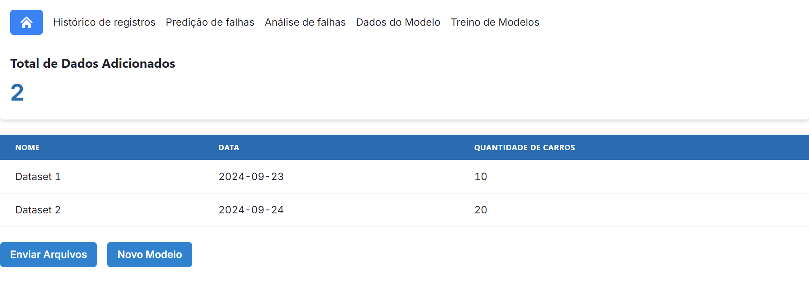

# Ajustes de usabilidade na IU

&emsp;A fim de aprimorar a usabilidade da UI (Interface de Usuário) da solução, a equipe It-Cross refinou diversos detalhes do frontend do sistema.

## Padronização de estilos

&emsp;Com o intuito de adequar todas as páginas existentes no frontend, foram deletados vários arquivos ``.css`` erroneamente utilizados durante o período de desenvolvimento. Em vez disso, a estilização das páginas e componentes React passou a ser feita totalmente através de Tailwind, o que possibilitou que as cores, planos de fundo, tamanho e padding — entre outros — de componentes seguissem um mesmo padrão e melhorou a experiência do usuário na medida em que facilitou o raciocínio necessário para este navegar e acionar as funcionalidades do sistema. Além disso, essa padronização permite maior manutenção e maior alteração de código.

## Aprimoramento da Navbar

&emsp;A navbar, componente em formato de barra horizontal com função de facilitar a navegação na aplicação web da solução, também foi alterada durante a sprint 5. Ela passou por um processo de componentização, o que eleva a legibilidade e facilidade de manutenção do código, tendo em vista que, até a sprint anterior a navbar era inscrita de maneira estática no código do componente de cada página da solução.

&emsp;Além disso, para atender aos feedbacks apresentados pelos usuários da solução durante os testes de usabilidade promovidos pela equipe It-Cross, a navbar também teve ajustes de estilização na sprint 5. Ela passou a apresentar um destaque azul quando o cursor do mouse passa sobre um de seus botões de navegação e outro destaque, também em um tom de azul, para indicar a página atual na qual o usuário está, como demonstra a imagem a seguir.

Figura 1 - Aparência atual da navbar

Fonte: Elaborado pela equipe It-Cross

## Refatoração da página de dados

&emsp;Por fim, os ajustes de usabilidade feitos durante a última sprint de desenvolvimento do projeto também contemplam a refatoração da página de dados. Sua aparência foi completamente alterada, a fim de garantir que ela dialogue com a estilização definida para todas as outras páginas da solução, o que não era visto até a sprint 4. 

Figura 2 - Página de dados anterior

Fonte: Elaborado pela equipe It-Cross

Figura 3 - Página de dados atual

Fonte: Elaborado pela equipe It-Cross

&emsp;Como é observado nas imagnes acima, a disposição dos elementos contidos na página também foi alterada. Um botão de redirecionamento para página de retreinamento do modelo foi excluído (uma vez que a navbar anula sua necessidade), o botão restante foi movido para baixo da tabela, que passou a ter o mesmo estilo das demais tabelas existentes nas páginas de histórico de registros e retreinamento do modelo. Além disso, a nomenclatura de alguns termos na página foi alterada com o intuito de não gerar ambiguidade para o usuário, como é possível verificar na mudança de "dados" para "datasets".